# owlingo: a Duolingo web clone

owlingo is a working clone of the Duolingo web app for English speakers learning Spanish. A learner follows a path of units and skills, plays lessons built from five kinds of exercises, earns XP and keeps a daily streak, loses and regains hearts, spends (mocked) gems in a shop, climbs weekly leagues against seeded competitors and collects achievements. The FastAPI backend owns every game rule (grading, hearts, streaks, XP, unlocks, leagues) on a carefully constrained SQLite schema. The Next.js frontend renders that state with Duolingo-style visuals, original SVG art, synthesized sound effects and browser text-to-speech. Visitors can play straight away as the seeded demo learner, or sign up with an email and password for an account of their own. A built-in demo clock lets anyone jump to tomorrow or to the end of the league week and watch the rules react; every learner has their own clock and their own league groups, so each account is a sandbox.

- **Live demo:** https://owlingo.vercel.app
- **API docs (Swagger UI):** https://owlingo-api.onrender.com/api/v1/docs
- **Engineering deep dive:** [docs/DESIGN.md](docs/DESIGN.md)

> The API runs on Render's free tier, which sleeps when idle. If it was asleep, the first load shows a wake-up screen for up to a minute while the server boots and re-seeds the demo. Accounts live in the same SQLite file, so a restart or redeploy of the service erases them (see [Keeping the demo alive](#keeping-the-demo-alive-during-review)).

## Contents

1. [Screenshots](#screenshots)
2. [Features](#features)
3. [Reviewer guide](#reviewer-guide)
4. [Tech stack](#tech-stack)
5. [Architecture overview](#architecture-overview)
6. [Database schema](#database-schema)
7. [API overview](#api-overview)
8. [Game rules in plain words](#game-rules-in-plain-words)
9. [Design decisions](#design-decisions)
10. [Local setup and testing](#local-setup-and-testing)
11. [Deployment](#deployment)
12. [Assumptions and deviations](#assumptions-and-deviations)
13. [Originality](#originality)
14. [Project structure](#project-structure)

## Screenshots

| | |
|---|---|
| 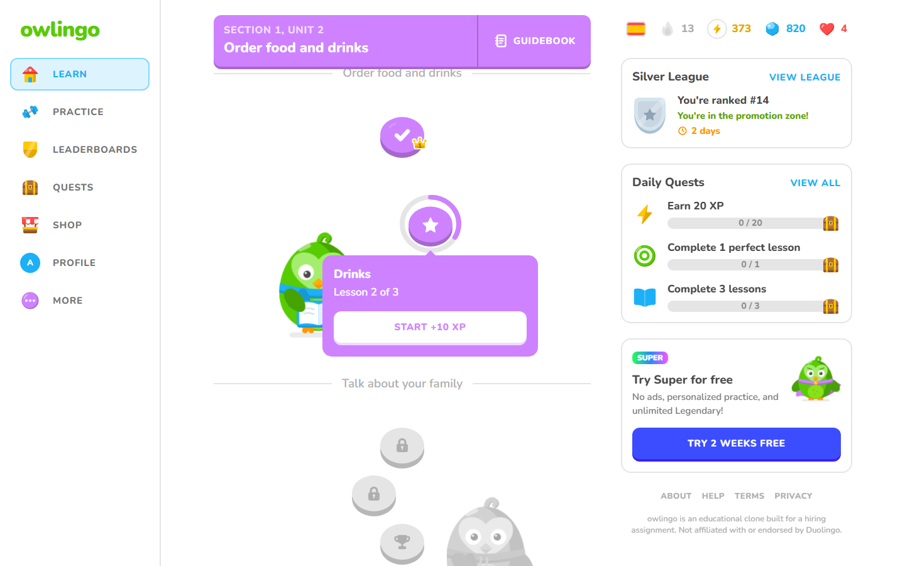 | 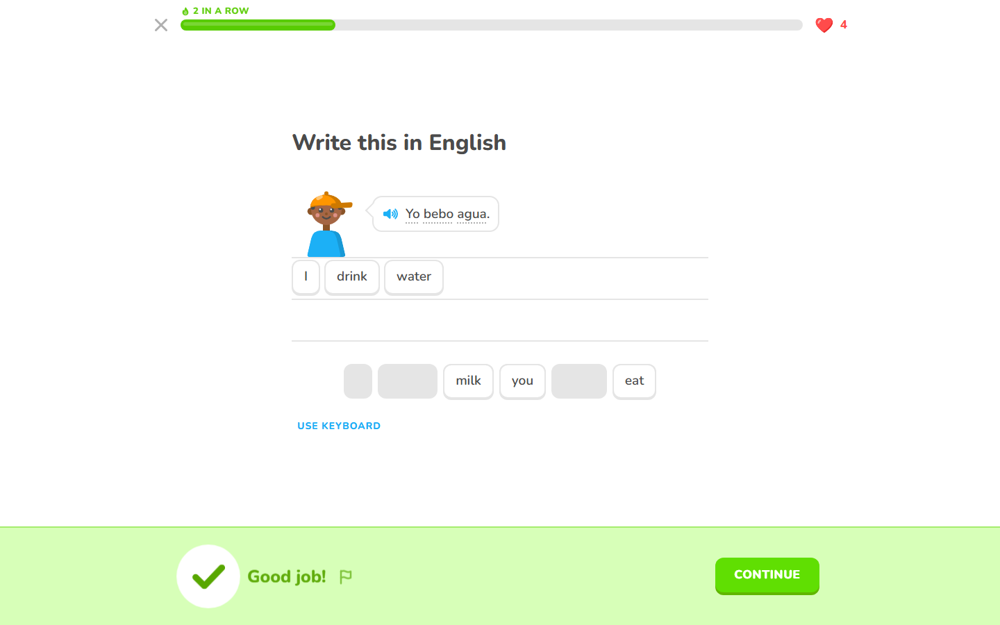 |
| Learning path with a node popover | Word-bank exercise and the feedback bar |
| 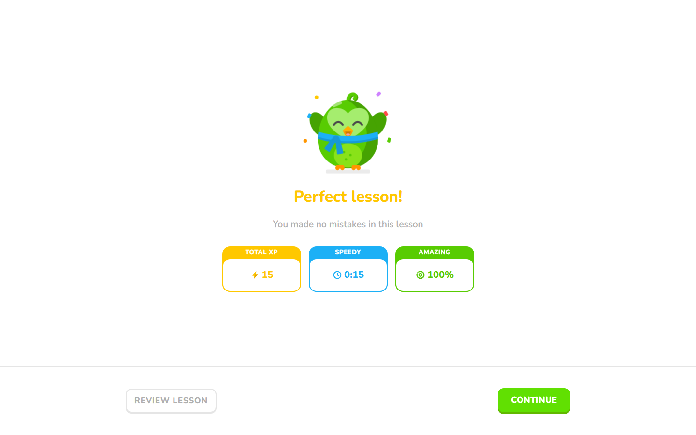 | 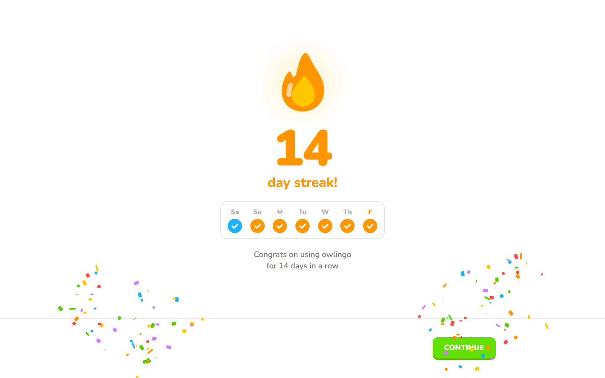 |
| Lesson complete | Streak extended |
| 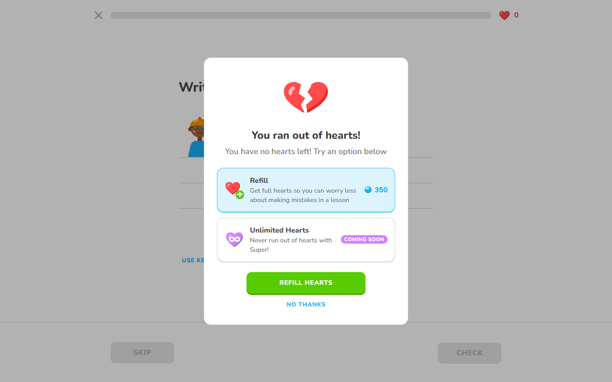 | 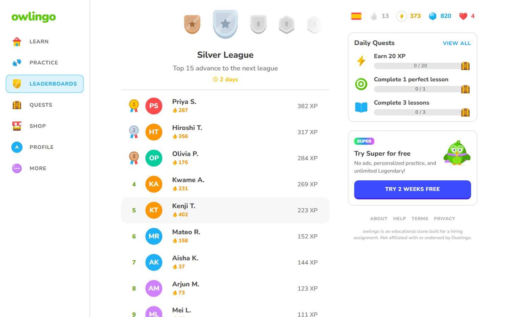 |
| Out of hearts | Weekly league with seeded competitors |
| 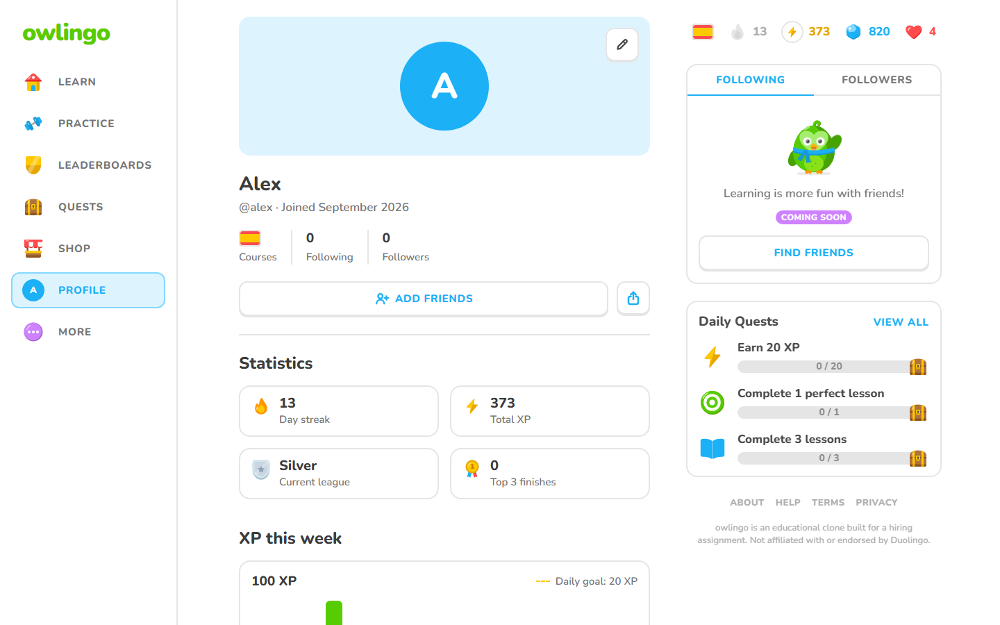 | 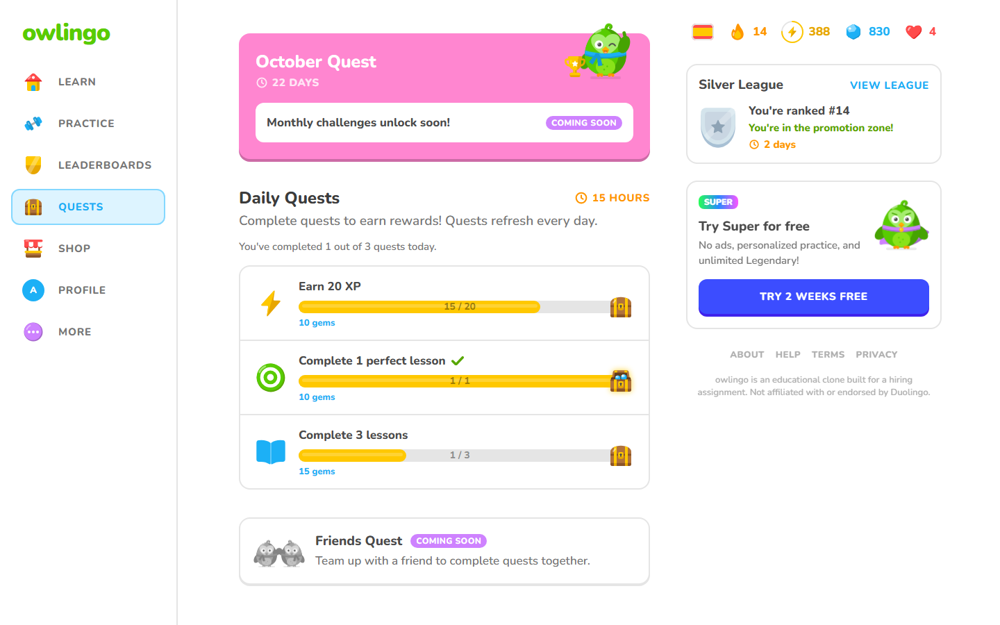 |
| Profile | Daily quests |
| 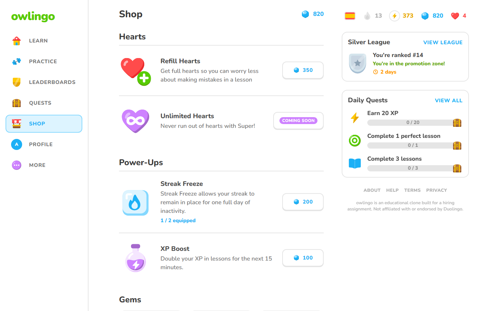 | 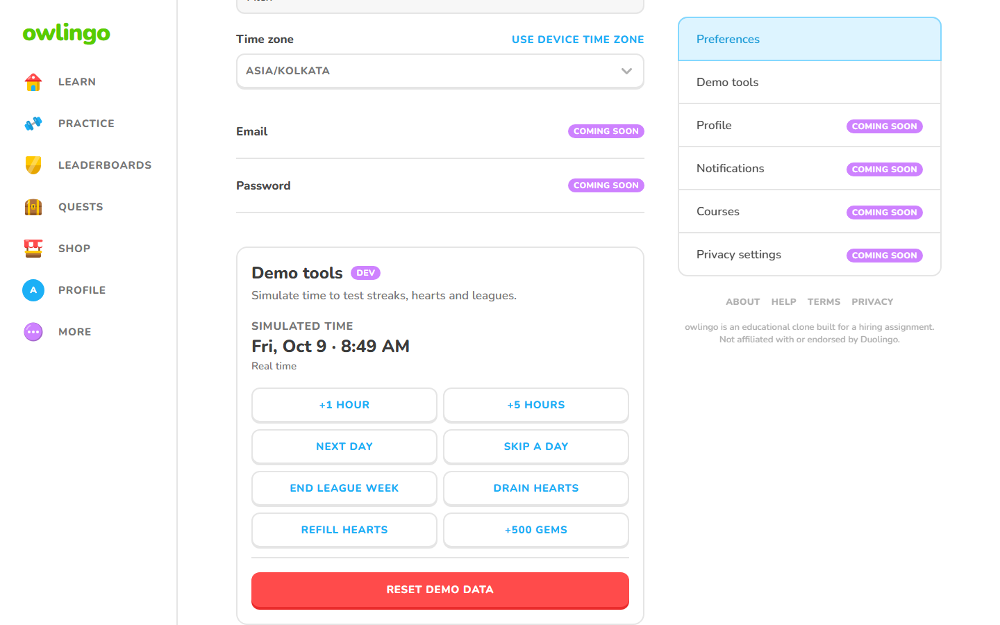 |
| Shop with mocked gems | Demo tools for simulated time |
| 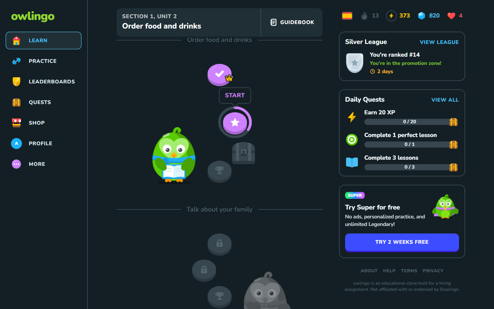 | 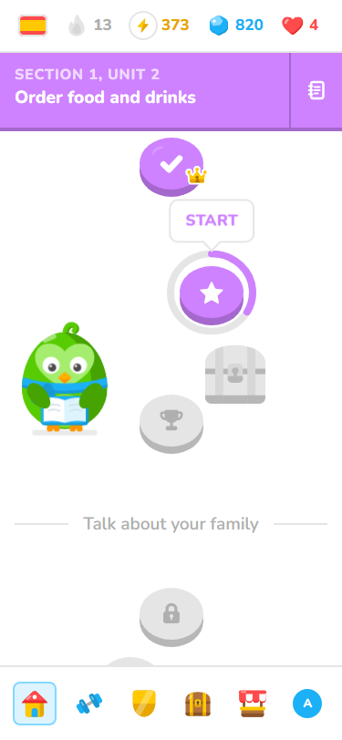 |
| Dark mode | Phone layout (375 px) |

## Features

Each item of the assignment, and where it lives.

### Core features

**1. Learning path / skill tree**

- [x] **Path of units and skills with lock/unlock progression.** `GET /me/path` returns every unit and node with a state the server derives from completed sessions (`backend/app/domain/path.py`). Lessons are played in order, so nothing can be skipped. The frontend draws the winding path (`frontend/src/features/path`).
- [x] **Completed vs available vs locked.** Node states are `locked`, `active` (the one current node), `available` (a reachable treasure chest), `completed` and `legendary`.
- [x] **Progress rings and crowns.** The active node's ring fills with lessons done out of the node's lessons. A finished skill gets a crown badge (level 1); a passed Legendary run turns it gold (level 2).
- [x] **Top bar with streak, XP, hearts and mocked gems.** Flag, streak, XP, gems and hearts, each with a popover (course menu, streak calendar and freezes, daily goal, gem balance, next-heart timer with refill and practice).

**2. Lesson player (the core loop)**

- [x] **Five exercise types:** multiple choice (text list or picture cards), translate (word bank tiles or typed with USE KEYBOARD), match pairs, fill in the blank, and type the answer (including "Type what you hear" listening exercises).
- [x] **Immediate feedback bar.** Every answer is graded by the server (`PUT /sessions/{sessionId}/items/{itemId}/answer`); the green or red bar shows the correct solution, notes about accents, typos or a missing word, and plays a sound.
- [x] **Progress bar.** It moves only when an exercise is resolved and never moves backwards; a missed exercise comes back at the end of the lesson labelled PREVIOUS MISTAKE.
- [x] **Hearts and failure.** A wrong answer or a skip in a lesson costs one heart. At zero hearts the lesson pauses behind the out-of-hearts modal: refill with gems and continue, or quit. Starting a lesson with zero hearts opens a start gate instead, offering a refill or "Practice to earn hearts". A Legendary run fails on its third mistake.
- [x] **XP and skill progress on completion.** Completion pays XP lines, extends the streak, joins the weekly league, pays quests and unlocks achievements in one transaction, then plays the celebration screens; back on the path the next node unlocks with an animation.

**3. Gamification and progress**

- [x] **Daily streak with simulated, testable days.** Days are counted in the learner's own time zone. Streak Freezes cover missed days. The Demo tools move the learner's own forward-only clock.
- [x] **XP totals and a leaderboard.** XP comes from an append-only ledger. Weekly leagues (Bronze to Diamond) rank the learner against 29 of 35 seeded competitors.
- [x] **Hearts regenerate over time, through practice or a refill.** One heart every 5 hours, +1 heart for each completed practice session, or a full refill for 350 gems.
- [x] **Daily goal indicator.** A thin ring around the XP bolt in the top bar, the "Earn 20 XP" daily quest, and the XP popover.
- [x] **Everything persists per user.** Sign up or log in, and all progress is stored in SQLite rows keyed by your account; the API tests prove that learners never see or move each other's data, clocks or league standings.

**4. Content management**

- [x] **Course content stored in the database and seeded.** Validated JSON files load 3 units, 11 path nodes, 19 lessons, 120 exercises and 69 glossary terms, plus a sample learner with a month of history.
- [x] **Learner profile with stats and achievements.** Streak, total XP, league, top-3 finishes, a weekly XP chart, a streak calendar and seven leveled achievements. Every competitor on the leaderboard has a profile too.
- [x] **All learner progress persists.** XP, sessions, gems, purchases and calendar days are ledger rows; node progress is derived from them.

**5. Duolingo experience**

- [x] **Playful UI with mascot flourishes.** An original owl mascot with 15 poses, three human characters in prompt bubbles, 26 picture-card illustrations, confetti and chunky 3D buttons.
- [x] **Animated lesson player.** Tiles fly between the word bank and the answer lines, the progress bar and combo counter animate, coach slides appear at 5 and 10 in a row.
- [x] **Modals, toasts and celebrations.** Lesson complete, streak extended, daily goal and quest rewards, heart earned, Legendary, achievement unlocks, out of hearts, quit confirmation, league results.
- [x] **Path navigation and progress visuals.** Unit banners with a Guidebook, node popovers with START, PRACTICE and LEGENDARY, a jump-to-current button and chest rewards.
- [x] **Settings placeholders.** Daily goal, theme, sound effects, animations, motivational messages, listening exercises and time zone all work; other sections open "Coming soon".

### Bonus features (all six)

- [x] **Audio for exercises:** browser text-to-speech in Spanish for prompts, tapped words and listening exercises, with a slow (turtle) replay.
- [x] **Achievements and badges:** Wildfire, Sage, Scholar, Sharpshooter, Champion, Winner and Legendary, with levels and unlock modals.
- [x] **Real functioning leaderboard:** cohorts of 30, live standings, promotion and demotion zones, weekly finalization and result modals.
- [x] **Timed practice and Legendary challenges:** a 30-second clock with time bonuses, and a no-hints, three-lives Legendary run that turns a skill gold.
- [x] **Dark mode:** system, light or dark, painted before the first frame so it never flashes.
- [x] **Responsive design:** phone, tablet, laptop and desktop layouts (bottom tabs, icon rail, right rail and full sidebar).

### Placeholder sections

- [x] **Speech recognition:** a Speaking card on the Practice page and a disabled "Speaking exercises" switch in Settings, both "Coming soon".
- [x] **In-app purchases and Super:** gems are mocked; gem packs, Unlimited Hearts and the Super page are "Coming soon".
- [x] **Friends and social:** friend controls on the profile and the `/friends` page are "Coming soon"; the leaderboard uses seeded competitors.
- [x] **Multiple languages:** the course menu lists French and German as unpublished "Coming soon" courses (`GET /courses`).
- [x] **Authentication:** built for real rather than as a placeholder: email and password accounts (sign up, log in, log out), with the seeded learner Alex kept as the instant, no-sign-up demo. Changing a password is "Coming soon".

## Reviewer guide

Everything below works on the hosted demo. The Demo tools live in **Settings → Demo tools**; whenever your simulated clock runs ahead of real time, a small DEV badge in the corner links back to them.

**Two ways in.** Opening the app goes straight to the path as the seeded demo learner, Alex: no sign-up. The landing page (`/welcome`, also MORE → ABOUT THIS CLONE) offers GET STARTED (sign up), I ALREADY HAVE AN ACCOUNT (log in) and TRY THE DEMO. Alex is one learner shared by every visitor without an account, so a "Create a profile to save your progress!" card invites you to an account of your own (in the right rail, on the profile and in Settings), and the MORE menu notes that everyone trying the demo shares this progress. An account of your own needs only a name, an email and a password of 8 or more characters; emails are never verified, so any address works.

**Starting point.** The seeded learner, Alex, is learning Spanish: a 13-day streak still at risk today (grey flame), one Streak Freeze equipped, 4 of 5 hearts, 820 gems, promoted to the Silver league last week, Unit 1 finished (with "Say hello" already Legendary), and the current lesson is **Drinks, lesson 2 of 3**. On the first visit the app quietly adopts your browser's time zone and, while the demo is untouched, rebuilds this starting point in it, so "today" is your own today. A new account starts like any new learner instead: the first lesson of Unit 1, 5 hearts, 500 gems, no streak, Bronze, in the device's time zone.

| To see… | Do this |
|---|---|
| Last week's league promotion | Open the app: the result modal says you advanced to the Silver League |
| A streak milestone (13 → 14) and Wildfire level 3 | Path → Drinks → START, and finish the lesson |
| The daily goal completed (+10 gems) | Finish a second lesson the same day |
| The streak at risk | The untouched demo already shows it; after a lesson, NEXT DAY shows it again |
| A heart regenerating | DRAIN HEARTS, then +5 HOURS |
| Running out of hearts | DRAIN HEARTS, then START a lesson; or lose your last heart mid-lesson, then REFILL (350 gems) or NO THANKS |
| Earning a heart back | Practice → Practice to earn hearts (open whenever hearts are below 5, including at zero) |
| A Streak Freeze covering a missed day | SKIP A DAY while the seeded freeze is equipped: the missed day turns blue in the streak calendar |
| The streak lost | SKIP A DAY again, now with no freeze left |
| A league promotion or demotion | END LEAGUE WEEK: the week is finalized and the result modal appears |
| Legendary | Path → "Introduce yourself" → LEGENDARY (100 gems; 3 lives; 40 XP on a pass) |
| Timed practice | Practice → Timed practice |
| Typo and accent tolerance | In a typed exercise, leave out an accent or swap two letters of a long word |
| A competitor's profile | Leaderboard → click any row |
| Dark mode | Settings → Theme → Dark |
| A fresh start | Settings → Demo tools → RESET DEMO DATA (RESET MY PROGRESS on an account) |
| An account of your own | The rail's CREATE A PROFILE, MORE → CREATE A PROFILE, or GET STARTED on `/welcome`; the account opens on the path at Unit 1 |
| Log out and back in | MORE → LOG OUT (Settings → Account on a phone), then `/login` with the same email and password; a wrong email or password gets the same message |
| Accounts are sandboxes | On your account, press NEXT DAY a few times or RESET MY PROGRESS, then TRY THE DEMO (it signs you out): Alex's clock and progress have not moved. Log back in and your account is where you left it |

**Demo tools buttons**

| Button | What it does |
|---|---|
| +1 HOUR, +5 HOURS | Move the clock forward; +5 hours brings back one heart |
| NEXT DAY | Jump just past your next local midnight; a day with no XP becomes a missed day |
| SKIP A DAY | Make exactly one local day pass with no activity (one or two midnight jumps), so a freeze is used or the streak is lost |
| END LEAGUE WEEK | Jump just past next Monday 00:00 UTC, which finalizes the league week |
| DRAIN HEARTS, REFILL HEARTS | Set hearts to 0 or 5 |
| +500 GEMS | Add 500 gems (recorded in the gem ledger like any other movement) |
| RESET DEMO DATA | Demo learner: delete Alex's progress, return his clock to real time and rebuild the sample history in your current time zone |
| RESET MY PROGRESS | An account: delete its progress, return its clock to real time and start over at Unit 1 with 5 hearts and 500 gems (you stay signed in) |

> Every learner has their own clock, and the tools act only on the learner using them. Alex, though, is shared: everyone who tries the demo without an account moves the same clock and sees the same progress. Time only moves forward; the reset is the only way back to real time.

## Tech stack

| Layer | Choice | Why |
|---|---|---|
| Frontend framework | Next.js 16 (App Router), React 19, TypeScript 5.9 (strict) | Required by the assignment; file-based routes and route groups keep the app shell and the full-screen lesson apart |
| Styling | Tailwind CSS 4 over CSS custom-property tokens | One set of semantic tokens drives light and dark themes and the 3D button system |
| Server state | TanStack Query 5 | Caching, retries and invalidation without a global store; the server stays the source of truth |
| Animation | Motion 13 | Layout animations (tiles flying to the answer line) and spring celebrations |
| Dialogs | Radix Dialog and Popover | Focus trapping, Escape and ARIA for free; every visual is our own |
| Frontend tests | Vitest 5 (Node environment) | Fast tests for the pure logic: lesson reducer, celebrations, payloads, hotkeys |
| Backend framework | FastAPI 0.142 on Starlette 1.7, Uvicorn | Typed request and response models, dependency injection, generated OpenAPI docs |
| ORM and data | SQLAlchemy 2.0 (typed `Mapped[]` models), SQLite (WAL) | Declarative constraints, partial indexes and composite keys; a single file that boots with the app |
| Validation | Pydantic 2.13, pydantic-settings | One `ApiModel` base for camelCase wire models; environment-driven settings |
| Time zones | `zoneinfo` + `tzdata` | IANA zones for learner-local streak days on every platform |
| Accounts | `hashlib.scrypt`, `secrets` and `hmac` from the standard library | Memory-hard password hashing, random bearer tokens and constant-time checks with no extra dependency |
| Backend tests and lint | pytest 9 (+ pytest-cov, httpx2 for the TestClient), Ruff | Domain, database, API and seed suites; Ruff includes the timezone-aware datetime rules |
| Hosting | Vercel (frontend), Render free tier (backend) | Zero-cost hosting; the Render blueprint lives in `render.yaml` |
| CI | GitHub Actions | Ruff, seed validation and pytest; ESLint, type check, Vitest and a production build |

## Architecture overview

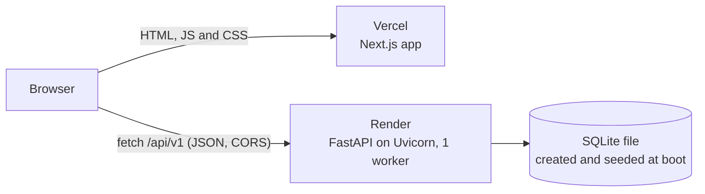
```mermaid
flowchart LR
  B["Browser"] -->|"HTML, JS and CSS"| V["Vercel<br/>Next.js app"]
  B -->|"fetch /api/v1 (JSON, CORS)"| R["Render<br/>FastAPI on Uvicorn, 1 worker"]
  R --> D[("SQLite file<br/>created and seeded at boot")]
```

Vercel serves the Next.js app; all data is fetched in the browser, straight from the FastAPI service on Render (no proxy), so a sleeping backend never blocks a page from painting. The backend stores everything in one SQLite file.

### Backend layers

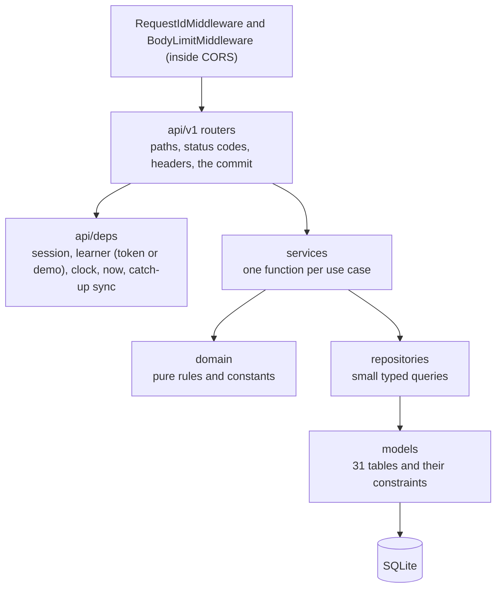
```mermaid
flowchart TB
  MW["RequestIdMiddleware and BodyLimitMiddleware (inside CORS)"] --> RT["api/v1 routers<br/>paths, status codes, headers, the commit"]
  RT --> DP["api/deps<br/>session, learner (token or demo), clock, now, catch-up sync"]
  RT --> SV["services<br/>one function per use case"]
  SV --> DM["domain<br/>pure rules and constants"]
  SV --> RP["repositories<br/>small typed queries"]
  RP --> MD["models<br/>31 tables and their constraints"]
  MD --> DB[("SQLite")]
```

| Layer | Owns | Never |
|---|---|---|
| `api/` | routes, status codes, headers, dependency wiring, the commit | touches models or SQL |
| `services/` | the order of rules for each use case, what gets persisted, which error to raise | commits, imports FastAPI, reads the clock |
| `domain/` | pure functions over plain data classes: grading, hearts, streak, XP, path, planners, leagues, bots, quests, achievements | imports SQLAlchemy, FastAPI or Pydantic; reads the clock |
| `repositories/` | small typed queries and eager loading | applies rules or commits |
| `models/` | tables, constraints and relationships | carries behaviour |

**One request, end to end.** The middleware assigns a request id and refuses a body over 64 KiB. FastAPI resolves the dependencies once per request: a database session, the current learner (the account an `Authorization: Bearer` token belongs to, or the demo learner when the request sends none), that learner's clock (real time plus their own offset), a single `now`, and the request context, which first brings the learner's state up to `now` (finalize the learner's ended league weeks, regenerate hearts, settle the streak, expire an idle session) and commits that catch-up; the learner's rows are then read again, so a write another tab committed in between is never acted on with stale values. The router then calls exactly one service function and commits its work. The response leaves with `X-Request-ID`, `X-Boot-Id`, `X-Server-Time` and `Cache-Control: no-store`. Writes are serialized by SQLite `BEGIN IMMEDIATE` transactions. The course content and catalogues never change while the server runs, so they are read once and kept in memory (`backend/app/services/reference.py`): a lesson completion runs about 54 SQL statements and a profile about 22.

**Time.** `backend/app/core/clock.py` is the only module that reads the wall clock (a test enforces it). A learner's game time is real UTC time plus a forward-only offset stored on their own row (`users.clock_offset_seconds`); the Demo tools only ever add to the caller's offset. Every rule receives the request's single `now`, and tests freeze it. Sign-in tokens and `/health` use real time, so time travel never signs anyone out.

### Frontend

- **Route groups.** `(main)` pages render inside the app shell (sidebar or tabs, top bar, right rail); `(lesson)/lesson/[sessionId]` is the full-screen player for every kind of session. Both sit behind `ServerWakeGate`, which shows a sleeping-owl screen while the API boots, keeps the server awake with a `/health` ping every 4 minutes, and notices a server restart from the `X-Boot-Id` header. `(auth)` holds `/login` and `/signup`, which paint at once and wake the server in the background while the visitor types.
- **Accounts.** A successful log-in or sign-up stores the token in `localStorage` (`frontend/src/lib/auth/tokenStore.ts`); `apiFetch` sends it as `Authorization: Bearer …`, and without one the API answers as the demo learner. Signing in, logging out or picking the demo while signed in empties the query cache, because every cached screen belonged to the previous learner. A `401 UNAUTHENTICATED` (an expired or revoked token, or a server restart that erased the account) drops the token, and the tab lands on the landing page with "You were signed out".
- **Server state** lives in TanStack Query: one hook per GET endpoint and one per write (`frontend/src/lib/queries`). Game numbers are never guessed on the client; caches change from the server's answers.
- **Lesson state** is one pure reducer (`frontend/src/lib/lesson/lessonMachine.ts`) driven by a controller hook that performs the requests, sounds and speech. A pure `buildCelebrations(receipt)` decides which celebration screens follow a lesson.
- **Server time.** Every countdown runs on server time, estimated from the `X-Server-Time` header, so time travel shows correctly in the browser.

The full request lifecycle, accounts and sign-in, the session engine and the frontend state machine are described in [docs/DESIGN.md](docs/DESIGN.md).

## Database schema

31 tables in five groups, linked by 41 foreign keys. Everything a learner does is stored as facts (sessions, answers, ledger rows); totals and progress are computed from those facts. The four diagrams below cover every table and every foreign key; a table from another group appears as a plain box where it connects.

**Content: the course tree**

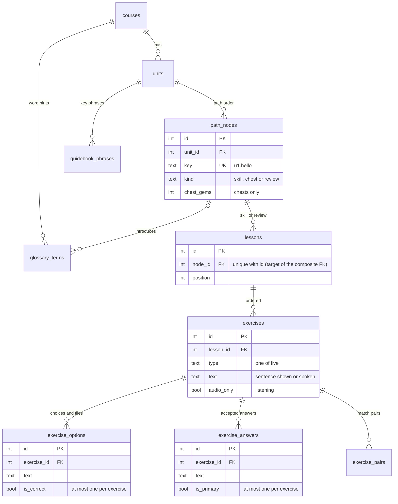
```mermaid
erDiagram
  courses ||--o{ units : has
  courses ||--o{ glossary_terms : "word hints"
  units ||--o{ path_nodes : "path order"
  units ||--o{ guidebook_phrases : "key phrases"
  path_nodes ||--o{ lessons : "skill or review"
  path_nodes |o--o{ glossary_terms : introduces
  lessons ||--o{ exercises : ordered
  exercises ||--o{ exercise_options : "choices and tiles"
  exercises ||--o{ exercise_answers : "accepted answers"
  exercises ||--o{ exercise_pairs : "match pairs"

  path_nodes {
    int id PK
    int unit_id FK
    text key UK "u1.hello"
    text kind "skill, chest or review"
    int chest_gems "chests only"
  }
  lessons {
    int id PK
    int node_id FK "unique with id (target of the composite FK)"
    int position
  }
  exercises {
    int id PK
    int lesson_id FK
    text type "one of five"
    text text "sentence shown or spoken"
    bool audio_only "listening"
  }
  exercise_options {
    int id PK
    int exercise_id FK
    text text
    bool is_correct "at most one per exercise"
  }
  exercise_answers {
    int id PK
    int exercise_id FK
    text text
    bool is_primary "at most one per exercise"
  }
```

**Learner and play: who plays, how they sign in, and each session's queue of attempts**

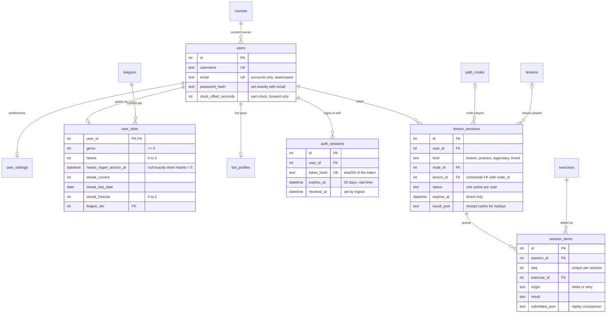
```mermaid
erDiagram
  courses ||--o{ users : "current course"
  users ||--o| user_settings : preferences
  users ||--o| user_stats : "game counters"
  users ||--o| bot_profiles : "bot pace"
  users ||--o{ auth_sessions : "signs in with"
  leagues ||--o{ user_stats : "current tier"
  users ||--o{ lesson_sessions : plays
  path_nodes |o--o{ lesson_sessions : "node played"
  lessons |o--o{ lesson_sessions : "lesson played"
  lesson_sessions ||--o{ session_items : queue
  exercises ||--o{ session_items : "asked as"

  users {
    int id PK
    text username UK
    text email UK "accounts only, lowercased"
    text password_hash "set exactly with email"
    int clock_offset_seconds "own clock, forward only"
  }
  auth_sessions {
    int id PK
    int user_id FK
    text token_hash UK "sha256 of the token"
    datetime expires_at "30 days, real time"
    datetime revoked_at "set by logout"
  }
  user_stats {
    int user_id PK, FK
    int gems ">= 0"
    int hearts "0 to 5"
    datetime hearts_regen_anchor_at "null exactly when hearts = 5"
    int streak_current
    date streak_last_date
    int streak_freezes "0 to 2"
    int league_tier FK
  }
  lesson_sessions {
    int id PK
    int user_id FK
    text kind "lesson, practice, legendary, timed"
    int node_id FK
    int lesson_id FK "composite FK with node_id"
    text status "one active per user"
    datetime expires_at "timed only"
    text result_json "receipt cache for replays"
  }
  session_items {
    int id PK
    int session_id FK
    int seq "unique per session"
    int exercise_id FK
    text origin "initial or retry"
    text result
    text submitted_json "replay comparison"
  }
```

**Ledgers: append-only XP and gem history, purchases and the streak calendar**

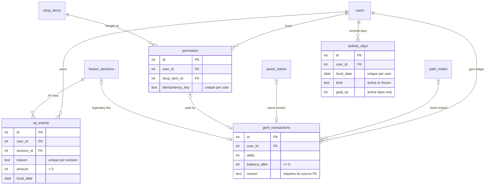
```mermaid
erDiagram
  users ||--o{ xp_events : earns
  lesson_sessions ||--o{ xp_events : "XP lines"
  users ||--o{ gem_transactions : "gem ledger"
  path_nodes |o--o{ gem_transactions : "chest reward"
  quest_claims |o--o| gem_transactions : "quest reward"
  purchases |o--o| gem_transactions : "paid by"
  lesson_sessions |o--o| gem_transactions : "legendary fee"
  users ||--o{ purchases : buys
  shop_items ||--o{ purchases : "bought as"
  users ||--o{ activity_days : "covered days"

  xp_events {
    int id PK
    int user_id FK
    int session_id FK
    text reason "unique per session"
    int amount "> 0"
    date local_date
  }
  gem_transactions {
    int id PK
    int user_id FK
    int delta
    int balance_after ">= 0"
    text reason "requires its source FK"
  }
  purchases {
    int id PK
    int user_id FK
    int shop_item_id FK
    text idempotency_key "unique per user"
  }
  activity_days {
    int id PK
    int user_id FK
    date local_date "unique per user"
    text kind "active or frozen"
    int goal_xp "active days only"
  }
```

**Gamification and system: leagues, achievements, quests, the shop catalogue and the seed bookkeeping**

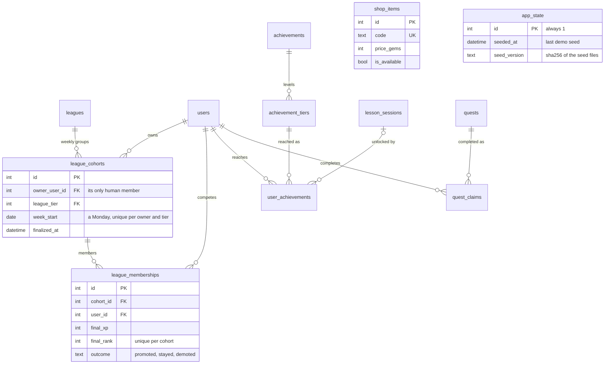
```mermaid
erDiagram
  leagues ||--o{ league_cohorts : "weekly groups"
  users ||--o{ league_cohorts : owns
  league_cohorts ||--o{ league_memberships : members
  users ||--o{ league_memberships : competes
  achievements ||--o{ achievement_tiers : levels
  achievement_tiers ||--o{ user_achievements : "reached as"
  users ||--o{ user_achievements : reaches
  lesson_sessions |o--o{ user_achievements : "unlocked by"
  quests ||--o{ quest_claims : "completed as"
  users ||--o{ quest_claims : completes

  league_cohorts {
    int id PK
    int owner_user_id FK "its only human member"
    int league_tier FK
    date week_start "a Monday, unique per owner and tier"
    datetime finalized_at
  }
  league_memberships {
    int id PK
    int cohort_id FK
    int user_id FK
    int final_xp
    int final_rank "unique per cohort"
    text outcome "promoted, stayed, demoted"
  }
  shop_items {
    int id PK
    text code UK
    int price_gems
    bool is_available
  }
  app_state {
    int id PK "always 1"
    datetime seeded_at "last demo seed"
    text seed_version "sha256 of the seed files"
  }
```

### Tables and the requirement each one serves

| Group | Tables | What they hold | Requirement |
|---|---|---|---|
| Content (10) | `courses`, `units`, `path_nodes`, `lessons`, `exercises`, `exercise_options`, `exercise_answers`, `exercise_pairs`, `guidebook_phrases`, `glossary_terms` | The course tree; typed child tables for choices and tiles, accepted answers and match pairs; Guidebook phrases; word hints | Course content stored in the database and seeded; five exercise types; path navigation |
| Learner (5) | `users`, `user_settings`, `user_stats`, `bot_profiles`, `auth_sessions` | The demo learner, accounts (email and password hash) and the 35 competitors (a bot is a user with a `bot_profiles` row); each human's forward-only clock offset; preferences; the only mutable counters; sign-in tokens, stored as hashes | Accounts and the demo learner, settings placeholders, progress that persists per user, simulated day logic, seeded leaderboard |
| Play (2) | `lesson_sessions`, `session_items` | One row per play-through and one row per attempt (retries are appended) | Lesson player, server-side grading, skill progress (derived) |
| Ledgers (4) | `xp_events`, `gem_transactions`, `purchases`, `activity_days` | Append-only XP and gem ledgers, purchases, and the streak calendar (active and frozen days) | XP totals, daily goal, mocked gems and refills, streak |
| Gamification and system (10) | `leagues`, `league_cohorts`, `league_memberships`, `achievements`, `achievement_tiers`, `user_achievements`, `shop_items`, `quests`, `quest_claims`, `app_state` | League ladder and each learner's private weekly cohorts, achievement catalogue and unlocks, shop catalogue, daily quests and paid rewards, the seed bookkeeping | Leaderboard, achievements, shop, daily goal quests |

### Stored vs derived

| Shown in the UI | Stored? | Source |
|---|---|---|
| Total XP, XP today, this week, per day | derived | `SUM(xp_events.amount)` by `local_date` or `earned_at` |
| Lessons done per node, rings, crowns, lock state, current node | derived | completed lesson sessions per node, passed Legendary runs and chest ledger rows, fed to `domain/path.py` |
| Words learned, perfect lessons, accuracy, combo, duration | derived | glossary terms of finished nodes; completed sessions; `session_items` and timestamps |
| Weekly league XP | derived | learners: ledger sum in the UTC week; bots: a pure function of their seed |
| Quest progress, achievement levels | derived | today's XP lines; statistics compared with tier thresholds (`quest_claims` and `user_achievements` record what was paid or first reached) |
| Hearts | **stored** | a token bucket needs a count and the start of the running interval |
| Streak, longest streak, last day, freezes | **stored** | a state machine; replaying it would need every past freeze decision |
| Gems | **stored (cached)** | the ledger balance, cached so `CHECK (gems >= 0)` can guard it; every ledger row records `balance_after` |
| League tier, final ranks and outcomes | **stored** | decisions taken when a week closes |

### Integrity rules

- **`ON DELETE`: cascade inside an aggregate, restrict across aggregates.** Deleting a course cascades through its units, nodes, lessons and exercises; deleting a user cascades through their settings, stats, sessions, ledgers, memberships, own league cohorts and sign-in sessions. A learner's history pointing at content or catalogue rows uses `RESTRICT`, so content that has history can never be deleted and history is never silently erased. Two optional links (`glossary_terms.node_id`, `user_achievements.session_id`) use `SET NULL`. In total: 29 cascade, 10 restrict, 2 set-null foreign keys.
- **Partial unique indexes** enforce "at most one": one correct choice per exercise, one primary accepted answer, one active session per learner, one chest claim per learner and chest, one legendary fee per session, one gem row per purchase and per quest claim.
- **A composite foreign key** `lesson_sessions(lesson_id, node_id) → lessons(id, node_id)` makes the database refuse a session whose node is not its lesson's node.
- **114 named CHECK constraints** cover enums, ranges and cross-column rules: hearts 0 to 5 with the anchor set exactly when below 5, gems never negative, at most two freezes, a session's status, end reason and end time always agreeing, each gem movement naming its source, a league week starting on a Monday, a forward-only clock offset per learner, an email and a password hash always set together, a token hash of exactly 64 characters (a SHA-256 in hex).
- **Every foreign key column leads an index** (SQLite does not create them); a test checks it.

The complete table list with columns, the index map and the SQLite lessons are in [docs/DESIGN.md](docs/DESIGN.md#2-schema).

## API overview

REST under `/api/v1`, camelCase JSON, ISO-8601 UTC instants ending in `Z`, and learner-local dates as `YYYY-MM-DD`. Interactive docs are at `/api/v1/docs` and the OpenAPI document at `/api/v1/openapi.json`. Learner endpoints act as the account whose token is sent as `Authorization: Bearer <token>`, or as the demo learner when no `Authorization` header is sent.

| # | Method | Path | Purpose |
|---|---|---|---|
| 1 | GET | `/health` | Liveness, seed status, the process's `bootId` and real time (never syncs or writes, and sends no `X-Server-Time`) |
| 2 | POST | `/auth/signup` | Create an account and sign it in (201): `{token, expiresAt, user}`; a taken email is `409 EMAIL_TAKEN` |
| 3 | POST | `/auth/login` | Exchange an email and password for a new token; a wrong email or password is `401 INVALID_CREDENTIALS` |
| 4 | POST | `/auth/logout` | Revoke the bearer token; always `{"loggedOut": true}` |
| 5 | GET | `/me` | Everything the shell shows: the learner (with `email` and `isDemo`), stats, hearts, streak, daily goal, league card, pending league result, settings |
| 6 | GET | `/me/settings` | Preferences and time zone |
| 7 | PATCH | `/me/settings` | Partial update; a new time zone reports whether the untouched sample history was rebuilt in it or the streak shifted |
| 8 | GET | `/me/activity?from&to` | One entry per local day: XP, goal in force, active / frozen / none (at most 92 days) |
| 9 | GET | `/me/path` | Units and nodes with state, crown, progress and the actions each node offers |
| 10 | POST | `/me/chests/{nodeId}/claim` | Open a reachable chest for its gems (once; a repeat replays) |
| 11 | GET | `/me/league` | Tier ladder, this week's standings and last week's result |
| 12 | POST | `/me/league/results/{membershipId}/ack` | Mark a league result modal as seen |
| 13 | GET | `/me/quests` | Today's three daily quests and their progress |
| 14 | POST | `/me/purchases` | Buy a shop item (requires `Idempotency-Key`); the only way to refill hearts |
| 15 | GET | `/me/purchases/{purchaseId}` | A purchase (the `Location` of a new one) |
| 16 | GET | `/users/{userId}/profile` | Profile stats and achievements; `userId` is an id or `me`, bots included |
| 17 | GET | `/courses` | Course menu (public, cached for 5 minutes) |
| 18 | GET | `/units/{unitId}/guidebook` | A unit's key phrases and tips (public, cached for 5 minutes) |
| 19 | GET | `/shop/items` | Shop catalogue with each item's availability for the learner |
| 20 | POST | `/sessions` | Start a lesson, practice, Legendary run or Timed practice (201), or resume the active one of the same kind and node (200) |
| 21 | GET | `/sessions/{sessionId}` | The whole session, so a refreshed page resumes at its current item |
| 22 | PUT | `/sessions/{sessionId}/items/{itemId}/answer` | Grade one answer slot (idempotent) |
| 23 | POST | `/sessions/{sessionId}/complete` | Pay the rewards and return the receipt with a fresh `me` (idempotent) |
| 24 | POST | `/sessions/{sessionId}/quit` | End a session early; the server decides the outcome (idempotent) |
| 25 | GET | `/dev/clock` | The caller's clock: real time, their offset and their simulated time |
| 26 | POST | `/dev/clock/advance` | Move the caller's time forward by 1 minute to 60 days |
| 27 | POST | `/dev/clock/next-day` | Jump just past the caller's next local midnight |
| 28 | POST | `/dev/clock/next-week` | Jump just past next Monday 00:00 UTC (league rollover) |
| 29 | PATCH | `/dev/learner` | Set the caller's hearts and/or gems for a demo (gems go through the ledger) |
| 30 | POST | `/dev/reset` | Start the caller over at real time: the demo learner gets the sample history again, an account a new account's start (Unit 1, 5 hearts, 500 gems) |

Every `/dev` tool acts on the caller alone, so trying them on an account never touches the demo learner or anyone else.

There is no separate refill, "practice to earn hearts" or achievements endpoint: a refill is a purchase of `heart_refill`, earning a heart is `POST /sessions {"kind": "practice"}`, and achievements come with the profile and the completion receipt.

### Errors

Every error is an RFC 9457 problem document (`application/problem+json`) with a stable `code` the frontend switches on, a learner-friendly `detail`, the `requestId` that appears in the server log, and extension members for a few codes. A real response:

```http
HTTP/1.1 409 Conflict
Content-Type: application/problem+json
X-Request-ID: d04b80edfb51
```

```json
{
  "type": "/problems/out-of-hearts",
  "title": "Out of hearts",
  "status": 409,
  "detail": "You have no hearts left. Refill your hearts or practice to earn one.",
  "instance": "/api/v1/sessions",
  "code": "OUT_OF_HEARTS",
  "requestId": "d04b80edfb51",
  "errors": [],
  "nextHeartAt": "2026-10-09T02:10:48.528Z"
}
```

`errors[]` is filled only for `VALIDATION_ERROR` (at most 20 entries), for example `{"field": "body.dailyGoalXp", "message": "Input should be 10, 20, 30 or 50", "kind": "literal_error"}`. Ids in the URL (`sessionId`, `itemId`, `nodeId`, `membershipId`, `purchaseId`, `userId`, `unitId`) must be 1 to 2^63−1 in ASCII digits, so an id the database could not hold is a 422 `VALIDATION_ERROR`, never a failed query; a request body over 64 KiB is refused unread with the same code. Unhandled exceptions become `500 INTERNAL_ERROR` inside the CORS middleware, so the browser can still read them.

<details>
<summary>All 29 error codes</summary>

| Code | HTTP | When |
|---|---|---|
| `VALIDATION_ERROR` | 422 | A body, query or path parameter fails its schema (`errors[]` lists up to 20 fields), an id is out of range, or the body is over 64 KiB |
| `INVALID_ANSWER` | 422 | The answer does not fit the exercise: another type, foreign option, tile or pair ids, a tile used twice, CAN'T LISTEN on a non-listening item, an incomplete matching |
| `IDEMPOTENCY_KEY_REUSED` | 422 | The same `Idempotency-Key` was used to buy a different item |
| `IDEMPOTENCY_KEY_REQUIRED` | 400 | A purchase without the header, or a key longer than 64 characters |
| `UNAUTHENTICATED` | 401 | The bearer token is unknown, expired or revoked, or the `Authorization` header holds no bearer token (sent with `WWW-Authenticate: Bearer`; the client drops the token) |
| `INVALID_CREDENTIALS` | 401 | A login with an unknown email or a wrong password: both get this same answer, after the same hashing work |
| `NOT_FOUND` | 404 | Unknown id, another learner's resource, or an unknown route |
| `METHOD_NOT_ALLOWED` | 405 | Wrong HTTP method |
| `BOT_ACCOUNT` | 403 | `X-User-Id` names a league bot |
| `DEV_TOOLS_DISABLED` | 403 | A `/dev` call while `ENABLE_DEV_TOOLS=false` |
| `NODE_LOCKED` | 409 | Starting or practicing a locked node |
| `NODE_NOT_PLAYABLE` | 409 | A lesson or practice on a chest; practice on an unfinished node; Legendary on a review, a chest or an unfinished skill; claiming a node that is not a chest |
| `NODE_ALREADY_COMPLETED` | 409 | A lesson on a finished node (the UI offers PRACTICE instead) |
| `ALREADY_LEGENDARY` | 409 | Legendary on a skill that is already gold |
| `NOTHING_TO_PRACTICE` | 409 | Global or Timed practice before any lesson was completed |
| `CHEST_LOCKED` | 409 | Opening a chest that is not reachable yet |
| `OUT_OF_HEARTS` | 409 | Starting, answering or completing a lesson with 0 hearts (`nextHeartAt`) |
| `INSUFFICIENT_GEMS` | 409 | A purchase or Legendary fee above the balance (`requiredGems`, `balance`) |
| `HEARTS_ALREADY_FULL` | 409 | Buying a refill with 5 hearts |
| `MAX_FREEZES_EQUIPPED` | 409 | Buying a third Streak Freeze |
| `ITEM_UNAVAILABLE` | 409 | Buying a "Coming soon" item |
| `SESSION_NOT_ACTIVE` | 409 | Answering an ended session, or completing a failed or abandoned one (`sessionStatus`, `endReason`) |
| `SESSION_EXPIRED` | 409 | A Timed practice answer after the deadline plus 5 seconds; complete the session instead (`expiresAt`) |
| `SESSION_INCOMPLETE` | 409 | Completing while items remain (and, in Timed practice, time is not up) |
| `ITEM_OUT_OF_ORDER` | 409 | Answering an item that is not the current one (`currentItemId`) |
| `ITEM_ALREADY_ANSWERED` | 409 | A second, different answer to an answered item |
| `LEAGUE_RESULT_NOT_READY` | 409 | Acknowledging a week that is not finalized |
| `EMAIL_TAKEN` | 409 | Signing up with an email that already has an account (emails are compared trimmed and lowercased) |
| `INTERNAL_ERROR` | 500 | Anything unexpected (logged with its traceback and request id) |

</details>

### Idempotency

Retries and double clicks are safe. Purchases carry an `Idempotency-Key` header because buying twice can be legitimate (a second Streak Freeze); every other write is idempotent through its natural key or guarded by a unique one.

| Write | How a repeat is handled |
|---|---|
| `POST /sessions` | The same kind and node resume the active session (200). Anything else ends the old one as superseded; a partial unique index allows one active session per learner |
| `PUT …/items/{itemId}/answer` | The URL names one answer slot. The same payload replays the stored grade (`"replayed": true`) with no side effects; a different payload is `409 ITEM_ALREADY_ANSWERED` |
| `POST …/complete` | A compare-and-set `UPDATE … WHERE status = 'active'` lets exactly one request pay the rewards; a repeat returns the cached receipt with a fresh `me`. `UNIQUE(session_id, reason)` on `xp_events` is the backstop |
| `POST …/quit` | Quitting an ended session replays its outcome |
| `POST /me/chests/{nodeId}/claim` | The gem ledger row is the claim, unique per learner and chest; a repeat replays it |
| `POST /me/purchases` | `UNIQUE(user_id, idempotency_key)`: the same key and item replay the purchase (200); the same key for another item is `422 IDEMPOTENCY_KEY_REUSED` |
| `POST /me/league/results/{membershipId}/ack` | Keeps the first acknowledgement time |
| `POST /auth/signup` | `UNIQUE(email)`: a repeat meets the account the first attempt created and is `409 EMAIL_TAKEN`, so the app never retries a signup on its own |
| `POST /auth/logout` | Revoking a token that is already revoked, expired or unknown changes nothing and still answers 200 |

### Accounts and the current learner

Each request acts as one learner, chosen in this order (`get_current_user` in `backend/app/api/deps.py`):

1. **A bearer token** (`Authorization: Bearer <token>`): the account it was issued to. A token that is unknown, expired or revoked, or a header with no bearer token in it, is `401 UNAUTHENTICATED`, never a quiet switch to the demo learner.
2. **`X-User-Id: <id>`**, only when `ALLOW_USER_HEADER=true` (local runs and tests): that learner. An unknown id is `404 NOT_FOUND`, a bot is `403 BOT_ACCOUNT`. The frontend never sends it, and it is off on Render (ignored, and not allowed by CORS). The API tests use it, next to real accounts, to prove that learners never see each other's data.
3. **Otherwise the demo learner** (`DEFAULT_USERNAME`, `alex`), so the demo works with no sign-in at all. `me.user.isDemo` tells the app which case it is in.

Sign-up takes a display name (1 to 40 characters), an email (trimmed, lowercased, a plausible shape, never verified) and a password of 8 to 128 characters, plus the device's time zone when the browser knows it. Passwords are hashed with the standard library's scrypt and a fresh salt; a token is 32 random bytes, returned once and stored only as its SHA-256 in `auth_sessions`, valid for 30 days of real time unless logout revokes it first. Logging in again issues another token alongside the first. The username is derived from the email (`ana@example.com` becomes `ana`, or `ana2` when `ana` is taken).

### Examples

Against a local backend (`jq` is optional and only shortens the output):

```bash
API=http://localhost:8000/api/v1

# 1. The learner's shell state
curl -s $API/me | jq '{streak: .streak.current, freezes: .streak.freezesEquipped, hearts: .hearts.current, gems, league: .league.name}'
# {"streak": 13, "freezes": 1, "hearts": 4, "gems": 820, "league": "Silver"}

# 2. Start a practice session (201 Created + Location), then answer its current item.
#    "skip" fits any exercise; practice re-asks a missed exercise once, as a retry at the end.
SESSION=$(curl -s -X POST $API/sessions -H 'Content-Type: application/json' -d '{"kind":"practice"}')
ID=$(echo "$SESSION" | jq .id); ITEM=$(echo "$SESSION" | jq .currentItemId)
curl -s -X PUT $API/sessions/$ID/items/$ITEM/answer -H 'Content-Type: application/json' \
  -d '{"type":"skip"}' | jq '{result, replayed, progress, retrySeq: .appendedItem.seq}'
# {"result": "skipped", "replayed": false, "progress": {"completed": 0, "total": 10}, "retrySeq": 11}
# Sending the same request again returns the same grade with "replayed": true and changes nothing.

# 3. Buy a Streak Freeze with an idempotency key, then repeat the request
KEY=$(python -c "import uuid; print(uuid.uuid4())")
curl -s -o /dev/null -w "%{http_code}\n" -X POST $API/me/purchases -H 'Content-Type: application/json' \
  -H "Idempotency-Key: $KEY" -d '{"itemCode":"streak_freeze"}'      # 201
curl -s -X POST $API/me/purchases -H 'Content-Type: application/json' \
  -H "Idempotency-Key: $KEY" -d '{"itemCode":"streak_freeze"}' | jq '{replayed, gems, freezes: .effect.streakFreezes}'
# {"replayed": true, "gems": 620, "freezes": 2}    (charged once)

# 4. Sign up, then act as the new account with its token
TOKEN=$(curl -s -X POST $API/auth/signup -H 'Content-Type: application/json' \
  -d '{"displayName":"Ana","email":"ana@example.com","password":"correct horse","timezone":"Europe/Madrid"}' | jq -r .token)
curl -s $API/me -H "Authorization: Bearer $TOKEN" | jq '{name: .user.displayName, isDemo: .user.isDemo, hearts: .hearts.current, gems, league: .league.name}'
# {"name": "Ana", "isDemo": false, "hearts": 5, "gems": 500, "league": "Bronze"}
curl -s -X POST $API/auth/logout -H "Authorization: Bearer $TOKEN"     # {"loggedOut": true}
curl -s $API/me -H "Authorization: Bearer $TOKEN" | jq .code           # "UNAUTHENTICATED" (401)
```

## Game rules in plain words

All constants live in `backend/app/domain/rules.py` (prices and quest rewards are catalogue data in `backend/app/seed/data/catalog.json`).

| Rule | Value |
|---|---|
| New account | the first lesson of Unit 1, 5 hearts, 500 gems, no streak, Bronze, daily goal 20 XP |
| Hearts | 5 at most; one comes back every 5 hours (`HEART_REGEN_MINUTES=300`) |
| Heart refill | 350 gems, the same price everywhere |
| Practice reward | +1 heart for each completed practice session |
| Lesson XP | 10 per lesson, 40 for a unit review |
| Practice XP | 5 for practicing a finished node, 10 for "Practice to earn hearts" |
| Combo bonus | up to +5 XP: `min(5, ceil(5 × longest correct run ÷ planned exercises))` in lessons, practice and Legendary |
| XP Boost | 100 gems for 15 minutes of double XP (base and combo); boosts queue one after another; never in Timed practice |
| Daily goal | 10, 20, 30 or 50 XP (default 20) |
| Streak Freeze | 200 gems; at most 2 equipped |
| Streak milestones | 7, 14, 30, 50, 75, 100, 125, 150, 200, 250, 300, 365, then every 100 days |
| Practice session | 10 exercises; up to 5 picked from mistakes of the last 14 days; each missed one comes back once |
| Legendary | 100 gems to enter; up to 12 exercises; no hints; 3 lives; 40 XP plus combo on a pass |
| Timed practice | 30 s to start; +5 s per correct multiple choice or match, +10 s per correct translate or fill in the blank; up to 20 exercises; 1 XP per correct answer |
| Idle session | abandoned after 2 hours without an answer or a resume |
| Leagues | unlock after 10 completed sessions of any kind; private cohorts of 30 (the learner plus 29 bots drawn from 35) |
| League ladder (promote / demote) | Bronze 20/0 · Silver 15/7 · Gold 10/7 · Sapphire, Ruby, Emerald, Amethyst and Pearl 7/7 · Obsidian 5/7 · Diamond 0/5 |
| Chests | 20 gems each, once |
| Daily quests | 3 a day: the daily goal (10 gems), one core quest (10 gems), one hard quest (15 gems) |

**Grading.** The server compares the answer with every accepted answer (the primary one first). Case, punctuation, extra spaces, curly quotes and English contractions ("I'm" = "I am") never matter. Word-bank tiles must then match exactly. Typed answers are also forgiven:

- **missing or wrong accents**: correct, with "Pay attention to the accents." and the accented solution;
- **one small typo** in one word: correct, with "You have a typo.", but only when the expected word has at least 4 letters, the typed word keeps its last letter (which carries gender and number: *hermano* is not *hermana*), the slip is a single edit (a swap of two neighbouring letters counts as one), and **the typed word is not itself a word of the course**. That last guard means "Buenos noches" for "Buenas noches" and "La padre se llama Elena" for "La madre se llama Elena" are wrong answers, because *buenos* and *padre* are real words the learner chose.

A wrong answer that leaves out one word or gets one word wrong says "You missed a word." or "You used the wrong word." under the correct solution.

**Hearts.** Only lessons use hearts: a wrong answer or a skip costs one. At 0 hearts a lesson is not lost; it pauses until a refill (350 gems) or a regenerated heart lets it continue, or the learner quits. Hearts refill lazily: the regeneration timer starts with the first heart lost from a full set (later losses do not restart it), and every request adds one heart per whole 5-hour interval since the timer started, keeping the remainder, so nothing runs in the background. Practice never costs hearts and pays one back.

**Streak and freezes.** A streak day is a local calendar day (in the learner's time zone) on which a completed session earned XP. On every request, days that ended without activity are settled: each missed day uses one equipped Streak Freeze, oldest first, and shows as a frozen (blue) day; frozen days keep the streak alive but do not lengthen it. If a missed day finds no freeze, the streak is lost (freezes spent along the way stay spent). The flame is grey ("at risk") until today's first session, then orange.

**XP and combo.** Each completed session writes one ledger row per XP line: the base amount, the combo bonus and the boost's extra. The combo is the longest run of correct answers in the session; a perfect 6-exercise lesson earns 10 + 5 = 15 XP. Failed or abandoned sessions earn nothing.

**Leagues and seeded competitors.** A league week is one global window from Monday 00:00 UTC. Once leagues are unlocked, the learner's first XP of the week opens their own cohort of their tier, and 29 bots are drawn for it from a pool of 35, seeded by the learner, the tier and the week, so every process draws the same field. Every learner competes in private cohorts (a bot can sit in many at once), so one account's time travel never moves another learner's board. Ties go to whoever reached the XP first. When a week ends on the learner's clock, their next request finalizes it: every member gets a final XP, rank and outcome, the top places promote (with at least 1 XP) and the bottom places demote. A learner who earned no XP that week has no membership, so a skipped week never demotes. Bots are ordinary users with a profile row: a bot's weekly XP is a pure function of its seed, pace, the week and the tier, made of 10 to 20 XP sessions spread over the week, and only sessions before "now" count, so the board moves with real and simulated time without writing anything. A bot's profile total is its baseline plus its league XP in the viewer's own cohorts, so its profile always agrees with the viewer's board.

**Legendary.** On a finished skill, LEGENDARY charges 100 gems and starts a run of up to 12 of the skill's exercises, with typing, translating and fill-in-the-blank first and never match pairs. There are no hints, no hearts and no timer; the third mistake fails the run (the gems stay spent, and TRY AGAIN starts a new paid run). A pass pays 40 XP plus combo and turns the skill gold.

**Timed practice.** Once a lesson is completed, Timed practice draws up to 20 quick exercises (multiple choice, match pairs, fill in the blank, word-bank translate) from completed lessons. The clock starts at 30 seconds and each correct answer adds 5 or 10 seconds. The deadline lives on the server (with 5 seconds of grace for the network): a correct answer accepted in that grace, after the clock showed zero, still adds its bonus, and the run goes on; otherwise running out of time is a normal end. Each correct answer is worth 1 XP, with no combo bonus and no boost.

**Daily quests and achievements.** Every local day brings three quests: the daily goal, plus one core and one hard quest picked deterministically for that learner and day. Rewards are paid automatically when a session completes a quest. Achievements have levels that compare one statistic with thresholds: Wildfire (longest streak), Sage (total XP), Scholar (words learned), Sharpshooter (perfect lessons), Champion (highest league), Winner (first places) and Legendary (first place in Diamond).

## Design decisions

Six principles shape the code:

| # | Principle | In practice |
|---|---|---|
| P1 | Store facts, derive aggregates | XP totals, node progress, lock state, words learned and accuracy are computed from `xp_events`, `lesson_sessions` and `session_items` |
| P2 | Store state only for real state machines or database-guarded balances | `user_stats` holds hearts, streak, freezes, gems and the league tier, each for a stated reason |
| P3 | The database is the last line of defence | Deliberate `ON DELETE` rules, CHECKs for enums, ranges and cross-column rules, partial unique indexes, a composite foreign key |
| P4 | The server is authoritative; the client renders | Grading, hearts, retries, XP, streak, unlocks and league joins all happen on the server |
| P5 | Time is injected, never read | One clock module, one `now` per request, a forward-only offset per learner |
| P6 | Every mutation is idempotent or guarded | Answer slots, compare-and-set completion, unique XP lines, idempotency keys, unique chest claims, resumable session starts |

**Why does the server grade answers?**
XP, hearts and streaks are the product, so they cannot depend on a client's word. The browser gets option ids and text, never a flag saying which choice is right, and the server returns the verdict. (Two exercises carry what they need on purpose: match pairs share an id so each tap gets instant feedback, and a listening prompt carries its sentence for speech.) One grader also means one place to fix a grading rule.

**Where is a learner's progress stored?**
Nowhere as a separate number. A node's progress is the count of distinct lessons completed in it, plus "a Legendary run was passed" and "a chest row exists". `domain/path.py` turns those facts into states, rings and crowns, so the path can never disagree with the history, and resetting the demo is just deleting rows.

**How do you stop double XP when "complete" is sent twice?**
Three layers. Writes are serialized by `BEGIN IMMEDIATE`; a single `UPDATE … SET status = 'completed' … WHERE id = ? AND status = 'active'` lets only one request win; and `xp_events` has `UNIQUE(session_id, reason)`. The winner caches the receipt, and a repeat returns that receipt with a freshly built `me`.

**What stops a double click from costing two hearts?**
An answer is a `PUT` to one item of the session's queue. An identical repeat replays the stored grade without side effects, and a different payload is refused with 409.

**How do hearts come back without a background job?**
Hearts are a token bucket: a count plus the instant the running interval started. Each request adds one heart per whole interval since then and keeps the remainder. A CHECK ties "no anchor" to "hearts are full", and both columns are always written together.

**How can "tomorrow" be tested?**
Every rule takes `now` as an argument. Production uses real time plus the learner's stored offset, which the Demo tools increase; tests swap in a frozen clock and move it explicitly. A request reads the clock once, so the catch-up sync and the handler always agree on the time.

**Why can't time go backwards?**
Rows would end up in the future: a streak day after today, or XP earned tomorrow. Each learner's offset has a `CHECK (clock_offset_seconds >= 0)`, and the only rewind is the reset, which deletes that learner's data and starts them over.

**Why does every learner have their own clock?**
So every account is a sandbox. If time were global, one visitor pressing END LEAGUE WEEK would end everyone's week. With an offset per learner and private league cohorts, a jump or a reset touches only the caller. The demo learner is still one shared learner, which the app says wherever it matters.

**How are accounts kept safe?**
Passwords are hashed with scrypt from Python's standard library, with a fresh salt and the parameters stored in each hash, and checked in constant time. A session token is 32 random bytes; only its SHA-256 is stored, so a copy of the database holds no usable token, and logging out revokes it. A login with an unknown email is checked against a hash nothing matches, so it takes as long as a wrong password and gets the same `401`: neither the answer nor its timing tells whether an account exists.

**How does the leaderboard move without other real learners?**
Thirty-five seeded bots are real users whose weekly XP is a pure, cached function of their seed, pace, week, tier and the current time. Each learner competes against 29 of them in private cohorts; learners' XP is a ledger sum. Weeks finalize lazily, one at a time, writing final XP and rank for every member.

**Why child tables for exercises instead of a JSON column?**
Accepted answers, choices, tiles and pairs get foreign keys, "exactly one correct choice" and "one primary answer" become partial unique indexes, match sides are unique, and everything is plain SQL. JSON appears only in two write-once caches (the submitted answer and the completion receipt).

**Why SQLite with `BEGIN IMMEDIATE` and one worker?**
The catch-up sync writes even on GET requests, and a page fires several queries at once. With deferred transactions two requests can both read and then fail to upgrade to the write lock ("database is locked"). Taking the lock at `BEGIN` makes them queue instead; each transaction takes milliseconds. A test runs concurrent read-modify-write transactions and checks that no update is lost.

**What did SQLite teach about CHECK constraints?**
SQLite checks them after every statement and cannot defer them. So a CHECK may only couple columns that are always written by the same statement: the completion compare-and-set sets status, end reason and end time together, and the receipt cache is deliberately left unconstrained.

**Why is all data fetched in the browser?**
Render's free instance can take up to a minute to wake. Server-side fetching would hold the first paint hostage; instead the static shell paints at once, a wake-up screen covers the wait, and requests pause until `/health` answers.

## Local setup and testing

Requirements: Python 3.12 and Node.js 24 (npm 11). The backend needs no `.env` file: the defaults in `backend/.env.example` are the local settings.

### Backend

```bash
cd backend

# Option A: uv
uv venv --python 3.12
uv pip install -r requirements-dev.txt

# Option B: the standard library
python -m venv .venv
.venv/bin/pip install -r requirements-dev.txt    # Windows: .venv\Scripts\pip install -r requirements-dev.txt

# Then activate the environment and start the API
source .venv/bin/activate                        # Windows: .venv\Scripts\activate
uvicorn app.main:app --reload                    # http://localhost:8000/api/v1/docs
```

On startup the server creates `backend/data/app.db` and seeds it if it is empty. Other useful commands, run from `backend/`:

```bash
python -m app.seed --check      # validate the seed files and print the totals (no database needed)
python -m app.seed --reset      # drop and rebuild the local database (stop the server first)
pytest -q                       # the full backend suite (a few minutes)
ruff check .                    # lint
```

`POST /api/v1/dev/reset` (RESET DEMO DATA in the app, RESET MY PROGRESS on an account) rebuilds the caller's data without restarting.

### Frontend

```bash
cd frontend
nvm use                         # Node 24, from .nvmrc
npm ci
cp .env.example .env.local      # NEXT_PUBLIC_API_BASE_URL=http://localhost:8000/api/v1
npm run dev                     # http://localhost:3000
```

```bash
npm test                        # Vitest (pure logic)
npm run lint                    # ESLint
npm run typecheck               # tsc --noEmit
npm run build                   # production build
```

The backend allows `http://localhost:3000` by default; for another origin set `CORS_ORIGINS` (comma-separated) in `backend/.env`.

### Environment variables

| Variable | Default | Purpose |
|---|---|---|
| `DATABASE_URL` | `sqlite:///./data/app.db` | SQLite file (its folder is created at startup) |
| `CORS_ORIGINS` | `http://localhost:3000` | Comma-separated exact browser origins |
| `CORS_ORIGIN_REGEX` | empty | Optional origin pattern, e.g. for Vercel preview deployments |
| `DEFAULT_USERNAME` | `alex` | The demo learner, served to requests without a token |
| `ALLOW_USER_HEADER` | `true` | Honour `X-User-Id` (keep it `false` in production) |
| `ENABLE_DEV_TOOLS` | `true` | The `/dev` time-travel and reset endpoints |
| `SEED_TIMEZONE` | `Asia/Kolkata` | The sample learner's zone until the browser's zone is adopted |
| `HEART_REGEN_MINUTES` | `300` | Minutes per regenerated heart |
| `LOG_LEVEL` | `info` | Backend log level |
| `NEXT_PUBLIC_API_BASE_URL` | `http://localhost:8000/api/v1` | Frontend: the API root, including `/api/v1` |
| `NEXT_PUBLIC_APP_NAME` | `owlingo` | Frontend: the product name in the wordmark and page titles |

### Continuous integration

`.github/workflows/ci.yml` runs on pushes to `main` and on pull requests. Backend: `ruff check .`, `python -m app.seed --check`, then `pytest` with coverage. Frontend: `npm ci`, lint, type check, Vitest and `next build`.

## Deployment

### Backend on Render

1. In Render, choose **New → Blueprint** and connect the repository. Render reads `render.yaml`: a free Python web service named `owlingo-api` with root directory `backend`, build command `pip install -r requirements.txt`, start command `uvicorn app.main:app --host 0.0.0.0 --port $PORT --workers 1 --proxy-headers --forwarded-allow-ips="*"` and health check `/api/v1/health`.
2. Set the two variables the blueprint leaves blank (`sync: false`):
   - `CORS_ORIGINS`: the Vercel URL, for example `https://owlingo.vercel.app` (no trailing slash);
   - `CORS_ORIGIN_REGEX` (optional): `^https://<project>-[a-z0-9-]+\.vercel\.app$` to allow preview deployments.
3. The blueprint already sets `PYTHON_VERSION=3.12.13`, `DATABASE_URL=sqlite:///./data/app.db`, `DEFAULT_USERNAME=alex`, `ALLOW_USER_HEADER=false`, `ENABLE_DEV_TOOLS=true` (reviewers need the Demo tools), `SEED_TIMEZONE=Asia/Kolkata`, `HEART_REGEN_MINUTES=300` and `LOG_LEVEL=info`.

One worker is deliberate: SQLite has one writer, and requests are serialized at the database anyway.

### Frontend on Vercel

1. Import the repository and set **Root Directory** to `frontend` (framework preset Next.js; Node 24 comes from `package.json` `engines`).
2. Add `NEXT_PUBLIC_API_BASE_URL=https://<your-render-service>.onrender.com/api/v1` (and optionally `NEXT_PUBLIC_APP_NAME`) for Production and Preview. `NEXT_PUBLIC_` values are compiled into the build, so redeploy after changing them.
3. Deploy, then put the Vercel URL into `CORS_ORIGINS` on Render.

The build never calls the API, so a sleeping backend cannot break a frontend deploy.

### Keeping the demo alive during review

The SQLite file lives on Render's ephemeral disk. It is created and seeded on every boot, so a **redeploy, a restart, or a spin-down after about 15 idle minutes** brings back a fresh demo and **erases every account** created since the last boot (the sign-up and log-in pages say so). The app notices the new `X-Boot-Id` and tells the learner "The demo server restarted, so progress was reset"; a signed-in tab finds its token refused and is signed out.

- **Built-in keep-alive.** While the app is open in a browser it pings `/api/v1/health` every 4 minutes, so a reviewer who pauses does not lose their progress.
- **Scheduled keep-alive.** `.github/workflows/keep-alive.yml` requests `/api/v1/health` every 5 minutes, so the server (and the accounts on it) stays up between deploys even with no tab open (set the repository variable `API_URL` if the backend URL differs). GitHub may delay scheduled runs at busy times, so for extra safety a free uptime monitor (for example UptimeRobot or cron-job.org) can ping the same URL. `/health` never writes, so pings cost nothing in state, and one always-on free service fits within Render's monthly free hours.
- **Avoid redeploys during review.** `autoDeploy: true` redeploys (and re-seeds) on every push to the default branch: stop pushing once the link is shared, or set `autoDeploy: false`.

## Assumptions and deviations

- **Accounts plus an instant demo.** Visitors can sign up, log in and log out with an email and password, and their progress is stored under their account. A request without a token still acts as the seeded learner, Alex, so the demo link works with no sign-up; Alex is shared by everyone who has not signed in, which the guest card and the MORE menu point out. Emails are not verified, there is no password reset, and changing a password is "Coming soon". `X-User-Id` exists for local runs and tests only.
- **A sandbox per account.** Every learner has their own forward-only clock and their own league cohorts, and the Demo tools and the reset act only on the caller. The demo learner's reset rebuilds the sample history; an account's reset starts it over at Unit 1 with 5 hearts and 500 gems.
- **XP in the top bar.** Duolingo's web top bar has no XP counter, but the assignment asks for one, so an XP pill sits between the streak and the gems, with the daily goal drawn as a thin ring around its bolt.
- **Three stat cards** on the lesson-complete screen: total XP (counting up through the combo and boost), time and accuracy.
- **Crown badges.** Finished skills carry a small crown with their level (1 when completed, a gold crown when Legendary), because the assignment asks for crowns per skill.
- **Legendary is untimed; Timed practice is separate.** Legendary has no timer, as on Duolingo web. The assignment's "timed practice" is its own mode with a server-enforced moving deadline. A failed Legendary run earns no partial XP.
- **Match-pair mistakes cost no heart.** A wrong pair flashes red and only counts in the lesson statistics; the exercise is submitted once every pair is matched.
- **One refill price.** A heart refill costs 350 gems everywhere, including inside a lesson.
- **Typo policy.** One small typo in a word of 4 or more letters is forgiven, never a change of the last letter and never a slip that spells another word of the course; word-bank answers must be exact.
- **Time zone adoption.** On the first visit the app adopts the browser's time zone. While the demo learner is untouched (no session started and no gems moved since the demo was seeded), the server rebuilds the sample history in that zone (`timezoneEffect: "reseeded"`), so every stored day, from today's XP to the streak calendar, is a day of the reviewer's zone. Otherwise, and for later changes made in Settings, the streak's last covered day moves by the calendar difference between the two zones (`"shifted"`), so the streak is neither broken nor inflated; calendar days already stored keep their dates, so the calendar can show a gap or an overlap at the switch. Old zone names that some browsers still report are stored under their current IANA name (Chrome's `Asia/Calcutta` becomes `Asia/Kolkata`), so an Indian visitor is already in the seeded zone and nothing changes (`"none"`).
- **UTC league weeks.** A league week is one global window from Monday 00:00 UTC, while streak days follow the learner's own zone.
- **Leaderboard unlock after 10 sessions.** Leagues open after 10 completed sessions of any kind (lessons, practice, Legendary or Timed), in the spirit of Duolingo's "complete 10 lessons".
- **Rewards.** Quest rewards are paid automatically when a session completes a quest (no CLAIM button). Achievements and podium finishes pay no gems; chests and quests are the gem sources.
- **Coming soon areas.** Speaking exercises and speaking practice, Super and Unlimited Hearts, gem packs, friends (with Friends Quests and the Friendly and Photogenic achievements), monthly challenges, Mistakes review and Stories in Practice, more courses (French and German), profile editing and sharing, and password changes.
- **Text-to-speech depends on the browser's voices.** Speech uses the Web Speech API with a Spanish voice when the device has one. Without a voice, the speaker buttons hide and listening exercises are skipped without penalty.
- **Ephemeral data on the hosted demo.** Accounts live in the same SQLite file as the demo, so a restart or redeploy of the Render service erases them; the keep-alive and the deploy freeze described in [Deployment](#deployment) keep the service running between deploys.

## Originality

- All icons, league and achievement badges, picture-card illustrations, the three human characters and the owl mascot are original SVG drawn for this project.
- Sound effects are synthesized at runtime with the Web Audio API; the app ships no audio files. Speech comes from the browser's Web Speech API.
- Nunito (SIL Open Font License, loaded through `next/font`) stands in for Duolingo's proprietary typeface.
- The product is called **owlingo** (one constant; rename it with `NEXT_PUBLIC_APP_NAME`). Duolingo's logo, wordmark and mascot are never used, and a footer note (in the right rail, on the landing page and in Settings) says the app is an unaffiliated educational clone.
- The colour palette follows Duolingo's publicly documented brand colours, and only short UI phrases (CHECK, CONTINUE, "Coming soon") are reproduced for a familiar feel. All Spanish course content was written for this project.
- No Duolingo assets and no code from other clones are used.

## Project structure

```text
.
├── README.md
├── docs/DESIGN.md                  # engineering deep dive
├── render.yaml                     # Render blueprint for the backend
├── .github/workflows/ci.yml        # backend: ruff, seed check, pytest · frontend: lint, typecheck, vitest, build
├── backend/
│   ├── requirements.txt            # exact runtime pins (requirements-dev.txt adds the test tools)
│   ├── pyproject.toml              # Ruff and pytest settings
│   ├── app/
│   │   ├── main.py                 # app factory: middleware, CORS, problem handlers, routers, startup seed
│   │   ├── core/                   # settings, the clock, SQLite engine and schema check, error codes,
│   │   │                           #   column types, password hashing and tokens
│   │   ├── domain/                 # pure game rules and every constant (rules.py)
│   │   ├── models/                 # the 31 tables and their constraints
│   │   ├── repositories/           # small typed queries
│   │   ├── services/               # use cases: accounts, sync, sessions, rewards, receipts, shop, leagues, ...
│   │   ├── schemas/                # Pydantic wire models (camelCase)
│   │   ├── api/                    # dependencies, middleware, problem documents, v1 routers
│   │   └── seed/                   # JSON course and catalogue, validators, loader, sample learner, CLI
│   └── tests/                      # domain, db, api and seed suites, plus the invariant checker
└── frontend/
    ├── package.json                # exact pins; Node 24
    └── src/
        ├── app/                    # routes: (main) pages, (lesson)/lesson/[sessionId], (auth)/login and
        │                           #   signup, welcome, errors
        ├── components/             # ui primitives, icons, illustrations, mascot (all original SVG)
        ├── features/               # auth, shell, stats, rail, path, lesson, practice, leaderboard,
        │                           #   quests, shop, profile, settings, guidebook
        └── lib/                    # API client and types, session token, query hooks, lesson reducer,
                                    #   server clock, theme, sound, speech
```
