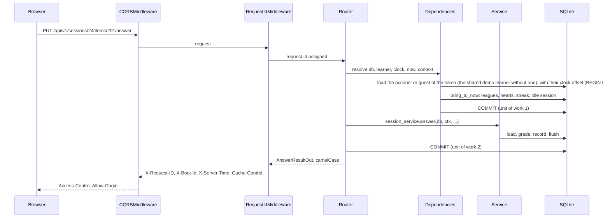
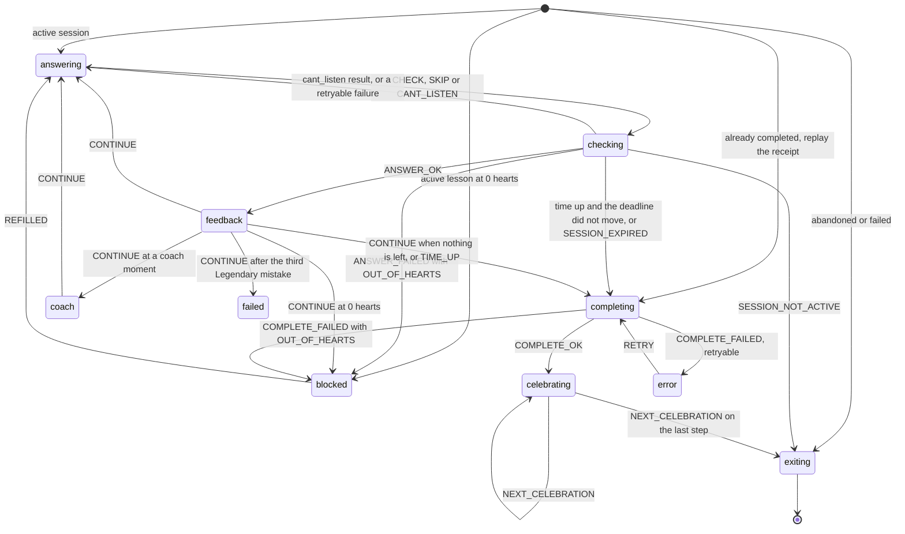

# owlingo: engineering design

This document explains how owlingo works inside: the schema and its constraints, what happens during a request, how accounts sign in and every visitor gets a private demo, how each learner's time is simulated, the session engine, the game rules and the frontend architecture. The [README](../README.md) covers features, setup, the API overview and the game rules in plain words; this document goes one level deeper and points at the code.

## Contents

1. [Principles and trade-offs](#1-principles-and-trade-offs)
2. [Schema](#2-schema)
3. [The request lifecycle](#3-the-request-lifecycle)
4. [Accounts and sign-in](#4-accounts-and-sign-in)
5. [The clock and time travel](#5-the-clock-and-time-travel)
6. [The catch-up sync](#6-the-catch-up-sync)
7. [The session engine](#7-the-session-engine)
8. [The grading pipeline](#8-the-grading-pipeline)
9. [Hearts: a lazy token bucket](#9-hearts-a-lazy-token-bucket)
10. [Streak: settle and credit](#10-streak-settle-and-credit)
11. [Leagues and the bot XP function](#11-leagues-and-the-bot-xp-function)
12. [Achievements, quests, gems and the shop](#12-achievements-quests-gems-and-the-shop)
13. [The seed pipeline](#13-the-seed-pipeline)
14. [Frontend architecture](#14-frontend-architecture)
15. [Testing strategy](#15-testing-strategy)
16. [Code tour: one answer, end to end](#16-code-tour-one-answer-end-to-end)
17. [Next steps](#17-next-steps)

## 1. Principles and trade-offs

| # | Principle | Consequence in the code |
|---|---|---|
| P1 | **Store facts, derive aggregates.** | XP totals, node progress, lock state, words learned and accuracy are computed from `xp_events`, `lesson_sessions` and `session_items`. Nothing caches them. |
| P2 | **Store state only for real state machines or DB-guarded balances.** | `user_stats` holds hearts (a token bucket), the streak, freezes, gems (`CHECK (gems >= 0)`) and the league tier. |
| P3 | **The database is the last line of defence.** | Foreign keys with deliberate `ON DELETE` rules, CHECKs for enums, ranges and cross-column rules, partial unique indexes for "at most one", one composite foreign key. |
| P4 | **The server is authoritative; the client is a renderer.** | Grading, hearts, the retry queue, XP, the streak, unlocks and league joins all happen in `backend/app/services` and `backend/app/domain`. |
| P5 | **Time is injected, never read.** | Only `backend/app/core/clock.py` reads the wall clock. Each request resolves one `now`. Each learner's demo offset only moves forward. |
| P6 | **Every mutation is idempotent or guarded.** | Answer slots, compare-and-set completion, `UNIQUE(session_id, reason)` on XP, the purchase `Idempotency-Key`, unique chest claims, resumable session starts. |

**Deliberate trade-offs**

| Decision | Alternative | Why this one |
|---|---|---|
| Node progress derived from completed sessions | a `node_progress` table | One source of truth: the lock state can never disagree with history, and a reset is a delete. It costs three small grouped queries. |
| Exercise content in typed child tables | a JSON payload column | Foreign keys on answers, partial unique "one correct" and "one primary", unique match sides, plain SQL. |
| Server-side queue of attempts (`session_items`) | the client re-queues and the server checks the outcome | Server-authoritative retries, exact resume after a refresh, answer idempotency by item id. |
| `PUT` per answer slot | `POST /answers` | The URL names exactly one slot, so a repeat is a safe replay and a different payload is a conflict. |
| One `now` per request and a forward-only offset per learner | one global offset, wall-clock reads | The sync and the handler agree; ledgers stay chronological; one learner's time travel never moves anyone else. |
| A private copy of the demo per visitor (a guest) | one demo learner shared by every visitor | One visitor's lesson never changes what another sees. A guest is an ordinary learner without credentials, built with the same pure history planner as the seed; the oldest beyond 500 are deleted. |
| Private league cohorts per learner | shared cohorts per tier and week | Each learner is a sandbox: weeks end on the owner's clock, so a jump finalizes only the jumper's weeks. Bots write no rows, so one bot can sit in any number of cohorts. |
| Opaque random tokens stored as SHA-256 | signed JWTs | Logout revokes a token with one `UPDATE`; there is no signing key to manage, and a copy of the database holds no usable token. |
| Password hashing with the standard library's scrypt | bcrypt or Argon2 packages | Memory-hard, no new dependency, and the parameters live in each hash, so the cost can be raised later. |
| `BEGIN IMMEDIATE` and one worker | optimistic `version` columns with retries | No lock-upgrade races and nothing to retry; constraints remain the backstop. |
| Lazy sync on every request | a cron job or background scheduler | A free host sleeps; each step is idempotent and deterministic given `now`. |
| Bots computed by a pure function | bot XP written into the ledger | No writes and no catch-up; the board still moves with real and simulated time. |
| History seeded through pure domain functions | replaying history through the services; hand-typed rows | Boot cannot fail on service logic, and consistency is proven by tests. |
| RFC 9457 problem documents | a custom error envelope | A standard shape with one handler per exception family. |
| Legendary untimed plus a separate Timed practice | one timed Legendary mode | Faithful to Duolingo web, and covers "timed practice" literally. |
| No migrations (no Alembic) | a migration baseline | The database is rebuilt on every boot of the hosted demo; a local file made for an older schema is recognised by a fingerprint and rebuilt. |
| Client-side data fetching only | server-side rendering with data | A sleeping API would otherwise block the first paint for up to a minute. |
| A hand-written TypeScript contract | generated OpenAPI types | No generator step in either build; the backend's contract test parses the TypeScript file and fails on any drift. |

## 2. Schema

The SQLAlchemy models in `backend/app/models/` are the source of truth; `create_tables()` in `backend/app/core/db.py` builds the 31 tables at startup. There are no migrations: it stores a fingerprint of the schema (a hash of every `CREATE TABLE` and `CREATE INDEX` statement) in SQLite's `user_version`, and a file built for another schema, by an older version say, is dropped and rebuilt from scratch, then seeded, instead of failing on its first query.

### 2.1 Conventions

- **Keys.** Every entity has `id INTEGER PRIMARY KEY`. The 1:1 extensions (`user_settings`, `user_stats`, `bot_profiles`) use `user_id` as their primary key, and `leagues` uses its natural key `tier`. Natural keys are `UNIQUE` constraints.
- **Constraint names** come from a naming convention (`backend/app/models/base.py`): `pk_<table>`, `fk_<table>_<columns>_<referred>`, `uq_<table>_<columns>`, `ix_<table>_<columns>` and `ck_<table>_<short name>`; partial unique indexes are named `ux_<table>_<purpose>`. An integrity error therefore reads like `CHECK constraint failed: ck_user_stats_hearts_range`.
- **Enums** are Python `StrEnum`s stored as `VARCHAR(n)` plus a `CHECK (col IN (…))` (`str_enum()` in `backend/app/core/types.py`). **Booleans** are `INTEGER` plus `CHECK (col IN (0, 1))`. The same enum module feeds the models, the API schemas and the domain, so one change updates the CHECK and the contract together.
- **Instants** are UTC. The `UTCDateTime` column type refuses a naive datetime at bind time, stores naive UTC text (which sorts chronologically) and returns aware UTC values.
- **Local calendar days** (`xp_events.local_date`, `activity_days.local_date`, `quest_claims.local_date`, `user_stats.streak_last_date`) are `DATE`s computed once, at write time, in the learner's IANA zone, and never recomputed. League weeks (`league_cohorts.week_start`) are UTC Mondays.
- **No database clock defaults.** Every timestamp comes from the request's `now` (the learner's simulated time, or real time for sign-in sessions); a `CURRENT_TIMESTAMP` default would bypass the simulated clock.
- **`ON DELETE`: cascade inside an aggregate, restrict across aggregates.** The content aggregate (course → unit → node → lesson → exercise → children) cascades, and so does the learner aggregate (user → settings, stats, sign-in sessions, sessions → items, ledgers, memberships, claims, and the cohorts they own → memberships), so deleting a guest beyond the cap takes every row of theirs in one statement. Learner history pointing at content or catalogue rows is `RESTRICT`. Two informational links (`glossary_terms.node_id`, `user_achievements.session_id`) are `SET NULL`. That is 29 cascading, 10 restricting and 2 set-null foreign keys.
- **Every foreign key column leads an index**, because SQLite does not create them; `tests/db/test_fk_indexes.py` checks it, along with the `ON DELETE` policy and the index names.

In numbers: 31 tables, 41 foreign keys (one composite), 116 named CHECK constraints, 37 named UNIQUE constraints and 27 further indexes, 8 of them partial.

### 2.2 Tables by aggregate

**Content (10 tables): the course**

| Table | Main columns | Rules |
|---|---|---|
| `courses` | `slug`, `title`, `learning_language`, `from_language`, `tts_locale`, `flag_key`, `is_published`, `position` | `slug` and `position` unique; the two languages differ. Spanish is published; French and German are unpublished placeholders |
| `units` | `course_id`, `position`, `section`, `title`, `description`, `color`, `guidebook_tips_md` | unique `(course_id, position)`; `color` is a palette key (9 allowed), never a hex value |
| `path_nodes` | `unit_id`, `position`, `key`, `kind`, `title`, `chest_gems` | the assignment's "skills": `kind` is `skill`, `chest` or `review`; `chest_gems` is set exactly for chests and positive; `key` (`u1.hello`) is the stable id the seed history uses |
| `lessons` | `node_id`, `position` | unique `(node_id, position)`; unique `(id, node_id)` is the parent key of the composite foreign key |
| `exercises` | `lesson_id`, `position`, `key`, `type`, `instruction`, `text`, `text_language`, `text_translation`, `audio_only`, `is_new_word` | five types; `text` and `text_language` come together; match pairs have no text, every other type except multiple choice needs one; a fill-in sentence contains `___`; `audio_only` only on Spanish `type_answer` |
| `exercise_options` | `exercise_id`, `position`, `text`, `image_key`, `is_correct` | choices and word-bank tiles; partial unique index `ux_exercise_options_one_correct`: at most one correct choice (tiles never set it) |
| `exercise_answers` | `exercise_id`, `text`, `is_primary` | accepted answers, unique per exercise; `ux_exercise_answers_one_primary` |
| `exercise_pairs` | `exercise_id`, `position`, `learning_text`, `native_text` | each side unique per exercise |
| `guidebook_phrases` | `unit_id`, `position`, `text`, `translation` | a unit's key phrases |
| `glossary_terms` | `course_id`, `node_id`, `language`, `term`, `hint` | word hints, stored normalized ("buenos días"); unique per course and language; the node that introduces a term drives "words learned" |

**Learner (5 tables): who plays, and how they sign in**

| Table | Main columns | Rules |
|---|---|---|
| `users` | `username`, `display_name`, `avatar_color`, `timezone`, `timezone_confirmed`, `current_course_id`, `joined_at`, `email`, `password_hash`, `clock_offset_seconds`, `is_guest`, `history_seeded_at` | humans and bots; lowercase unique username; `#RRGGBB` colour; a bot is a user with a `bot_profiles` row (there is no `is_bot` flag to keep in sync). An account has a unique, lowercase `email` and a `password_hash`, always together (`ck_users_credentials_pair`); the shared demo learner, guests and the bots have neither. A guest (`is_guest`, a visitor's private demo) never has credentials (`ck_users_guest_without_credentials`). `history_seeded_at` is when the sample history was last written for the shared demo learner or a guest (null for accounts and bots). `clock_offset_seconds >= 0` is the learner's own forward-only clock |
| `user_settings` | `daily_goal_xp`, `theme`, `sound_effects`, `animations`, `motivational_messages`, `listening_exercises`, `updated_at` | humans only; goal in 10/20/30/50; theme in system/light/dark |
| `user_stats` | `gems`, `hearts`, `hearts_regen_anchor_at`, `streak_current`, `streak_longest`, `streak_last_date`, `streak_freezes`, `league_tier`, `xp_boost_until`, `updated_at` | the only mutable game counters: `gems >= 0`; `hearts` 0 to 5 with the anchor set exactly when below 5; longest ≥ current; a last streak day exactly when the streak is alive; freezes 0 to 2 |
| `bot_profiles` | `daily_xp`, `rng_seed`, `baseline_xp`, `baseline_streak` | the 35 seeded competitors: pace, seed and lifetime baseline |
| `auth_sessions` | `user_id`, `token_hash`, `created_at`, `expires_at`, `revoked_at` | one row per issued token; only the token's SHA-256 is kept (unique, exactly 64 characters); expires after it is created; revoked, if at all, after it is created. Its instants are real time, never the learner's simulated clock |

**Play (2 tables): sessions and their queue**

| Table | Main columns | Rules |
|---|---|---|
| `lesson_sessions` | `user_id`, `kind`, `node_id`, `lesson_id`, `status`, `end_reason`, `rng_seed`, `started_at`, `last_activity_at`, `expires_at`, `ended_at`, `mistakes`, `best_combo`, `result_json` | one play-through of kind `lesson`, `practice`, `legendary` or `timed`. 15 CHECKs, including: `lesson_id` exactly for lessons; a node required except for practice and timed; timed is global; `expires_at` exactly for timed; `status`, `end_reason` and `ended_at` always agree (completed ⇒ passed; failed ⇒ out_of_hearts or too_many_mistakes; abandoned ⇒ quit, idle_timeout or superseded). Partial unique `ux_lesson_sessions_one_active` on `user_id WHERE status = 'active'`. Composite foreign key `(lesson_id, node_id) → lessons(id, node_id)` |
| `session_items` | `session_id`, `seq`, `exercise_id`, `origin`, `from_mistakes`, `result`, `note`, `submitted_json`, `answered_at` | one row per attempt; unique `(session_id, seq)`; a retry is appended as `max(seq) + 1` with `origin = 'retry'`; `result`, `answered_at` and `submitted_json` are set together; notes `alternate`, `accent`, `typo` only on correct answers and `missing_word`, `wrong_word` only on incorrect ones |

**Ledgers and facts (4 tables): append-only history**

| Table | Main columns | Rules |
|---|---|---|
| `xp_events` | `user_id`, `session_id`, `reason`, `amount`, `earned_at`, `local_date` | the only source of every XP number; every line has a session; `UNIQUE(session_id, reason)` makes XP exactly-once per reason; `amount > 0` |
| `gem_transactions` | `user_id`, `delta`, `balance_after`, `reason`, `node_id`, `quest_claim_id`, `purchase_id`, `session_id`, `created_at` | `delta <> 0`, `balance_after >= 0`; each reason requires its source (`chest` → `node_id`, `quest` → `quest_claim_id`, `purchase` → `purchase_id`, `legendary_fee` → `session_id`); signs by reason; partial unique indexes make one chest claim per learner and node, one row per quest claim, one per purchase and one fee per session |
| `purchases` | `user_id`, `shop_item_id`, `price_gems`, `idempotency_key`, `purchased_at` | `UNIQUE(user_id, idempotency_key)`; the price is a snapshot |
| `activity_days` | `user_id`, `local_date`, `kind`, `goal_xp`, `created_at` | the streak calendar: `active` days carry the goal in force that day, `frozen` days were covered by a freeze; unique per learner and day |

**Gamification and system (10 tables)**

| Table | Main columns | Rules |
|---|---|---|
| `leagues` | `tier` (PK 1–10), `name`, `color`, `promote_count`, `demote_count` | no promotion from Diamond, no demotion from Bronze |
| `league_cohorts` | `owner_user_id`, `league_tier`, `week_start`, `created_at`, `finalized_at` | one learner's private group: one per (owner, tier, UTC week), and the owner is its only human member; `week_start` must be a Monday (`strftime('%w', week_start) = '1'`); partial index `ix_league_cohorts_open` on the owner's open cohorts |
| `league_memberships` | `cohort_id`, `user_id`, `joined_at`, `final_xp`, `final_rank`, `outcome`, `result_seen_at` | humans and bots; unique `(cohort_id, user_id)` and `(cohort_id, final_rank)`; the three final columns are set together; a result can be seen only once it exists |
| `achievements` | `code`, `name`, `description_template`, `metric`, `color`, `position` | 7 achievements, one statistic each |
| `achievement_tiers` | `achievement_id`, `level`, `threshold`, `description` | unique level and threshold per achievement |
| `user_achievements` | `user_id`, `achievement_tier_id`, `session_id`, `unlocked_at` | the first time a learner reached a level; unique per learner and tier |
| `shop_items` | `code`, `kind`, `section`, `name`, `description`, `price_gems`, `duration_minutes`, `is_available`, `position` | `duration_minutes` exactly for XP boosts; unavailable items show "Coming soon" |
| `quests` | `code`, `slot`, `title_template`, `metric`, `target`, `reward_gems`, `icon`, `position` | 9 quests in three slots; the daily-goal quest is slot 1 and has no fixed target |
| `quest_claims` | `user_id`, `quest_id`, `local_date`, `claimed_at` | a paid quest reward: unique per learner, quest and local day |
| `app_state` | `id` (always 1), `seeded_at`, `seed_version` | single row of seed bookkeeping: when the shared demo learner's history was last seeded (real time) and the sha256 of the seed files. Nothing about the clock is global |

### 2.3 Constraints worth a closer look

- **The composite foreign key.** `lesson_sessions.node_id` is needed on its own (Legendary and node-practice sessions have a node but no lesson); for lesson sessions it duplicates `lessons.node_id`. `FOREIGN KEY (lesson_id, node_id) REFERENCES lessons (id, node_id)` makes that duplicate safe: the database refuses a session whose node is not its lesson's node. Under SQL's MATCH SIMPLE rule the composite key is skipped when `lesson_id` is null, and `node_id` keeps its own foreign key.
- **The chest claim is a ledger row.** `ux_gem_transactions_chest_once ON gem_transactions (user_id, node_id) WHERE reason = 'chest'` guarantees one claim per learner and chest, so no `chest_claims` table exists.
- **"At most one" by partial unique index, "exactly one" by the seed validator.** The database guarantees at most one correct choice and one primary answer per exercise; the seed validator requires exactly one.
- **Per-reason gem sources** are one short CHECK each (`reason <> 'chest' OR node_id IS NOT NULL`, …) instead of a single exclusive-arc rule; other source columns are simply not forced to null, which keeps every CHECK readable.

### 2.4 The CHECK-per-statement lesson

SQLite evaluates CHECK constraints after **every statement** and cannot defer them to commit. A CHECK may therefore couple only columns that are always written by the same statement:

- A session's `status`, `end_reason` and `ended_at` are tied together by CHECKs, so they always change in one `UPDATE`: the completion compare-and-set sets all three (plus the `mistakes` and `best_combo` snapshots), and `_end()` in `session_service.py` assigns the three attributes together so they flush as one statement.
- `user_stats.hearts` and `hearts_regen_anchor_at` are tied by `ck_user_stats_hearts_anchor`, so `hearts_service._store()` always writes both.
- `session_items.result`, `answered_at` and `submitted_json` are paired by CHECKs and recorded together.
- `lesson_sessions.result_json` (the receipt cache) is deliberately **not** tied to `status`: it is written by a second statement after the rewards, and a CHECK such as "completed implies a receipt" would fail on the first statement.

### 2.5 Index map

| Index | Serves |
|---|---|
| unique `(course_id, position)`, `(unit_id, position)`, `(node_id, position)`, `(lesson_id, position)` | ordered loading of the path, lessons and exercises; natural keys for the seed |
| `ux_exercise_options_one_correct`, `ux_exercise_answers_one_primary`, the pair uniques | content invariants |
| `ux_lesson_sessions_one_active` | one active session per learner; resume and supersede |
| `ix_lesson_sessions_user_id_status_ended_at` | completed-session counts (league unlock, recent sessions), progress queries |
| `ix_lesson_sessions_node_id`, `ix_lesson_sessions_lesson_id_node_id` | foreign key coverage; per-node progress `GROUP BY` |
| unique `session_items (session_id, seq)` | the ordered queue; the current item is the lowest unanswered `seq` |
| `ix_session_items_exercise_id` | foreign key coverage; "recent mistakes" for practice |
| unique `xp_events (session_id, reason)` | exactly-once XP lines |
| `ix_xp_events_user_id_local_date` | XP today, the daily goal, the activity calendar, quests |
| `ix_xp_events_user_id_earned_at` | weekly league XP, total XP |
| `ux_gem_transactions_*` (4 partial) | one chest claim, one reward per quest claim, one row per purchase, one Legendary fee |
| `ix_gem_transactions_user_id_created_at` | ledger history and balance checks |
| unique `purchases (user_id, idempotency_key)` | idempotent purchases |
| unique `activity_days (user_id, local_date)` | the streak calendar: upsert on credit, insert-or-ignore on settle |
| unique `league_cohorts (owner_user_id, league_tier, week_start)`, `ix_league_cohorts_open (owner_user_id, week_start) WHERE finalized_at IS NULL` | cohort lookup on join (and the owner's foreign key); finalization of the owner's open cohorts |
| unique `league_memberships (cohort_id, user_id)`, `(cohort_id, final_rank)`, `ix_league_memberships_user_id` | standings, unique final ranks, "my membership this week" |
| unique `user_achievements (user_id, achievement_tier_id)` | unlock once |
| unique `quest_claims (user_id, quest_id, local_date)` | one reward per quest per day |
| unique `users (email)` | log-in lookup; one account per address (the many users without an email are NULLs, which never collide) |
| unique `auth_sessions (token_hash)` | the token lookup on every signed-in request |
| the remaining `ix_*` on foreign key columns | foreign key coverage |

### 2.6 Accepted redundancies and their guards

1. `user_stats.gems` caches the gem ledger's balance. Only `gems_service` writes it, in the same flush as its ledger row; each row records `balance_after`; invariant I1 checks `gems = SUM(delta) = last balance_after`.
2. `lesson_sessions.node_id` duplicates `lessons.node_id` for lesson sessions. Guard: the composite foreign key.
3. `xp_events.user_id` duplicates `lesson_sessions.user_id`. Guard: `rewards.apply_completion_rewards()` takes both from the session row; invariant I5 checks the join.
4. `lesson_sessions.mistakes` and `best_combo` snapshot the items so quests and achievements can filter in SQL. They are written by the completion compare-and-set; invariant I5 recomputes them.
5. `lesson_sessions.result_json` caches the completion response for replays only; it is never queried.

`xp_events.local_date`, `activity_days.goal_xp`, `purchases.price_gems` and `league_memberships.final_*` are not redundancies: each snapshots a time zone, goal, price or ranking decision at write time.

### 2.7 SQLite settings

`backend/app/core/db.py` builds every engine (the app's and the tests'):

- each connection runs `PRAGMA foreign_keys = ON`, `journal_mode = WAL`, `synchronous = NORMAL` and `busy_timeout = 5000`;
- the driver's own transaction handling is disabled (`isolation_level = None`) and every transaction starts with `BEGIN IMMEDIATE`, taking the write lock up front. The one exception is the health check's read, marked `READ_ONLY`: it starts with a plain `BEGIN`, which WAL lets read beside the writer, so `/health` answers at once even during a long write (a health check stuck behind the lock could make Render restart the service, and a restart erases the database).

Why: GET requests write during the catch-up sync, and a page fires several queries at once. With deferred transactions two requests can both read and then fail to upgrade to the write lock (`SQLITE_BUSY`, which no busy timeout fixes). Taking the lock at `BEGIN` makes them queue. Uvicorn runs one worker, each transaction takes milliseconds, and the partial and natural-key unique indexes are the backstop. `tests/db/test_concurrency.py` runs concurrent read-modify-write transactions and checks that no update is lost, that two simultaneous completions pay once, that two simultaneous purchases with one key charge once, and that a request held after its catch-up acts on what another tab committed meanwhile.

## 3. The request lifecycle

1. **Middleware.** `RequestIdMiddleware` (`backend/app/api/middleware.py`) is a plain ASGI middleware added inside `CORSMiddleware`. It echoes a valid incoming `X-Request-ID` or creates a 12-hex id, and on the way out adds `X-Request-ID`, `X-Boot-Id`, `X-Server-Time` (when the request resolved a `now`) and `Cache-Control: no-store` unless the route set its own. It also converts an unhandled exception into the `500 INTERNAL_ERROR` problem document itself: Starlette's last-resort handler sits outside CORS, so its response would lack CORS headers and the browser would hide it. It logs one line per request: method, path, status, duration and request id. Inside it, `BodyLimitMiddleware` refuses a body over 64 KiB (far above the largest real request) with a 422 `VALIDATION_ERROR`, from its `Content-Length` before reading anything, or once a chunked body passes the limit.
2. **Dependencies** (`backend/app/api/deps.py`), each resolved once per request and shared:
   - `get_db`: a session; whatever is not committed is rolled back when it closes. Its first SQL statement (here, loading the learner) opens the request's first `BEGIN IMMEDIATE`;
   - `bearer_token` and `get_current_user`: the account or guest of the `Authorization: Bearer` token, else the `X-User-Id` learner when allowed, else the shared demo learner (section 4);
   - `get_real_clock` (tests replace it with a `FrozenClock`) and `get_clock`: real time plus the learner's own `users.clock_offset_seconds`;
   - `get_now`: the request's single instant, also stored on `request.state` for the `X-Server-Time` header;
   - `get_ctx`: runs `sync_service.bring_to_now()` and **commits** it, expires everything read so far (so the handler reads the learner's rows again inside its own transaction), then returns `RequestContext(user, stats, now, today, settings)`;
   - `require_dev_tools` guards `/dev`; `idempotency_key` reads and checks the purchase header.
3. **The router calls exactly one service function** and then **commits** (unit of work 2). Routers never touch models or SQL.
4. **The completion route** builds a fresh `me` after its commit and attaches it to the receipt.
5. **Serialization.** Every schema extends `ApiModel` (`backend/app/schemas/base.py`): camelCase aliases, unknown input fields rejected, and every datetime serialized as ISO-8601 UTC with a `Z`.

**Two units of work at most.** The catch-up is committed on its own, so time that passed stays caught up even when the handler then fails with a 409. Committing in the router rather than in a dependency's teardown guarantees that the client never receives a 200 for a change that failed to commit. Another tab's request can run and commit between the two units of work; because the context's rows are re-read after the first commit, the handler acts on fresh values (a purchase sees gems just spent, a wrong answer the hearts of a refill just bought).

**Reference data.** The course content and the catalogues never change while the server runs, so `services/reference.py` reads them once per database into frozen dataclasses that every request shares (warmed at startup, dropped when the seed writes new content). A lesson completion runs about 54 SQL statements and a profile about 22.

**Errors.** Services raise `AppError` subclasses (`backend/app/core/errors.py`, no web-framework imports), each with a stable code, HTTP status, title, learner-friendly detail, optional extension members and the headers its status calls for (`WWW-Authenticate: Bearer` on a 401). Four handlers in `backend/app/api/problems.py` render problem documents: `AppError`, request validation (at most 20 field errors; field paths are Pydantic locations joined with dots, using the client's names, such as `body.dailyGoalXp` or `path.sessionId`), Starlette HTTP errors (404, 405 with its `Allow` header, and the body limit's 413, reported as a 422) and a backstop for anything else. Ids in the URL carry camelCase names (`sessionId`, `itemId`, `nodeId`, `membershipId`, `purchaseId`, `userId`, `unitId`) and must be 1 to 2^63−1 (SQLite's integer range) in ASCII digits, so an impossible id is a 422 rather than a query the database can't run. The generated OpenAPI documents error bodies as `application/problem+json`.

**Where validation lives**

| Concern | Layer | Result |
|---|---|---|
| Body size (at most 64 KiB) | `BodyLimitMiddleware` | 422 `VALIDATION_ERROR` |
| Shape, types, ranges, enums (`dailyGoalXp` in 10/20/30/50, IANA zone, text 1 to 200 characters, clock jumps of 1 minute to 60 days, `nodeId` rules, URL ids 1 to 2^63−1, a plausible email of at most 254 characters, a sign-up password of 8 to 128) | Pydantic schemas | 422 `VALIDATION_ERROR` |
| Who is asking (token, credentials, a free email) | `auth_service` | 401 `UNAUTHENTICATED` or `INVALID_CREDENTIALS`, 409 `EMAIL_TAKEN` |
| The answer fits the exercise (ids, type, CAN'T LISTEN only on listening) | `domain/grading.py` | 422 `INVALID_ANSWER` |
| Game rules (locked, hearts, gems, order, deadlines, key reuse) | domain decides, service raises | 409 or 422 with a specific code |
| Data integrity (FK, CHECK, UNIQUE) | SQLite | 500 (a bug), except idempotency races, which become replays |
| Seed content | `seed/schema.py` and `seed/validate.py` | startup fails loudly; CI fails first |

## 4. Accounts and sign-in

Visitors without an account play a guest, a private copy of the seeded demo learner, or sign up for an account of their own. An account is an ordinary `users` row with an email and a password hash; guests, the shared demo learner and the bots have neither. The code lives in `backend/app/core/security.py`, `backend/app/services/auth_service.py` and `backend/app/api/v1/auth.py`.

**Who is asking.** `get_current_user` picks the learner in this order:

1. **An `Authorization` header**: the account or guest of its bearer token. A header with no usable bearer token in it ("Basic …", an empty "Bearer") reads as an empty token, so it is refused rather than quietly served as the demo learner. An unknown, expired or revoked token is `401 UNAUTHENTICATED` with `WWW-Authenticate: Bearer`, which tells the client to drop it.
2. **`X-User-Id`**, only with `ALLOW_USER_HEADER=true` (local runs and tests): that learner (`404 NOT_FOUND` when unknown, `403 BOT_ACCOUNT` for a bot). A token wins over it.
3. **Otherwise the shared demo learner** (`DEFAULT_USERNAME`), so the API docs and curl need no sign-in. The app never relies on it: a visitor without a token gets a guest first. `me.user.isDemo` (a guest or the shared demo learner) and `me.user.email` tell the client which case it is in.

**Endpoints.** None of them acts as a learner, so none syncs or sends `X-Server-Time`, and every instant they write is real time.

| Endpoint | Does | Answers |
|---|---|---|
| `POST /auth/signup {displayName, email, password, timezone?}` | creates the account and signs it in | 201 `{token, expiresAt, user}`; `409 EMAIL_TAKEN` |
| `POST /auth/login {email, password}` | issues a new token; earlier tokens stay valid | 200 `{token, expiresAt, user}`; `401 INVALID_CREDENTIALS` |
| `POST /auth/logout` | revokes the bearer token | 200 `{loggedOut: true}`, also with no token or a dead one |
| `POST /auth/demo {timezone?}` | creates a guest and signs it in | 201 `{token, expiresAt, user}`; `422` for an unknown zone |

**Passwords.** `hash_password()` runs `hashlib.scrypt` with N = 2^14, r = 8 and p = 1 (about 16 MiB per hash), a fresh 16-byte salt and a 64-byte digest, and stores it self-describing as `scrypt$16384$8$1$<salt>$<hash>` (base64), so the cost can be raised later without breaking stored hashes. `verify_password()` derives again with the stored parameters and compares with `hmac.compare_digest`; a stored value in an unknown format never matches. A sign-up password has 8 to 128 characters; a log-in accepts any length up to 128, because a wrong password is simply wrong.

**No account enumeration.** A log-in for an unknown email is checked against `unused_password_hash()`, the cached hash of a random secret, so it does the same scrypt work as a wrong password and gets the same `401 INVALID_CREDENTIALS`. Neither the answer nor its timing tells whether an account exists.

**Tokens.** `secrets.token_urlsafe(32)` (43 characters) is returned once. `auth_sessions` keeps only its SHA-256 in hex, with `created_at`, `expires_at = created_at + 30 days` and `revoked_at`. A request's token is looked up by that digest, must be unrevoked, and must expire after the **real** current time: tokens never follow a learner's simulated clock, so time travel never signs anyone out. Logout sets `revoked_at`; revoking twice changes nothing.

**A new account.** `signup()` trims and lowercases the email (a plausible shape is required: one "@", a dotted domain, no spaces; it is never verified) and checks it is free. Writes are serialized by `BEGIN IMMEDIATE`, so two simultaneous sign-ups with one email can't both pass, and `UNIQUE(email)` is the backstop. The username comes from the email's local part (lowercase letters, digits and underscores, at most 32 characters, with the smallest numeric suffix from 2 that makes it unique). The account gets a random avatar colour, the first published course and an offset of 0; `start_new_account()` (`seed/sample_learner.py`) adds default settings and stats with 5 hearts and 500 gems, booked as a `seed` row of the gem ledger so the cached balance matches it. Nothing else is written: progress is derived from facts and a new account has none, so it starts at the first lesson of Unit 1. The device's time zone, when sent, is stored and counts as adopted; without one the account waits in `SEED_TIMEZONE` until the app adopts the device's zone.

**A guest.** `start_demo()` creates a user with `is_guest` set, a `guest_` username with 10 random lowercase hex digits (drawn again on the rare collision), the name and avatar colour of the sample learner's seed entry, the first published course and an offset of 0. Its zone is the body's (canonicalized, and adopted) or `SEED_TIMEZONE` (not yet adopted). `start_guest()` then gives it fresh settings and stats and the same sample history the seeded learner has (section 13), planned with the pure planner relative to the request's real time in that zone: 373 XP, a 13-day streak at risk, 820 gems, 4 hearts, last week's promotion pending, the same badges. Only its league standing can differ, since its own cohorts draw their own bots. The guest gets an ordinary token, but with no email or password it can never log in again, and signing up creates a separate, fresh account. At most `MAX_GUESTS` (500, in `domain/rules.py`) are kept: each new guest deletes the oldest guests beyond the cap, by id, and every row of theirs goes with them through `ON DELETE CASCADE` (their cohorts take the bots' memberships in them too).

**Every learner is a sandbox.** Each learner, guests included, has their own clock (section 5) and their own league cohorts (section 11), and every `/dev` tool, including the reset (section 13), acts on the caller alone. The shared demo learner only serves requests without a token.

## 5. The clock and time travel

`backend/app/core/clock.py` defines a `Clock` protocol with three implementations: `SystemClock` (the only wall-clock read in the app), `OffsetClock` (another clock plus a fixed offset) and `FrozenClock` (for tests, moved with `advance()`, never backwards). Domain functions receive `now` or `today`, never a clock.

**Simulated time** is `real UTC + users.clock_offset_seconds`: every human learner has an offset of their own, so one learner's time travel never moves anyone else. That works because nothing shared depends on a learner's clock: league cohorts are private (each has one human member, its owner), and bots write no rows, so their XP follows whichever clock reads it. The offset is **forward-only**: if time moved back, rows would sit in the future (a streak day after today, XP earned tomorrow). The database enforces it with `ck_users_offset_forward_only` (`clock_offset_seconds >= 0`), and `dev_service._jump_to()` refuses a step that does not move forward. `POST /dev/reset` is the only rewind: it deletes the caller's learner-side rows and sets their offset back to 0. Sign-in tokens and `/health` always use real time.

**Jumps** (`backend/app/services/dev_service.py`):

| Endpoint | Target |
|---|---|
| `POST /dev/clock/advance` | `now + delta`, 1 minute to 60 days in total |
| `POST /dev/clock/next-day` | the learner's next local midnight + 5 s |
| `POST /dev/clock/next-week` | next Monday 00:00 UTC + 5 s |

The handler adds `ceil(target − now)` seconds to the caller's offset (read under the request's write lock, so no step is lost), runs `bring_to_now()` at the new instant, commits, and reports both the new clock and the catch-up's effects (hearts gained, streak before and after, freezes used, league results, sessions expired). It also sets `request.state.now`, so `X-Server-Time` carries the new instant. The 5-second margin keeps a target safely inside the new day even where a DST change makes local midnight ambiguous. The frontend's SKIP A DAY makes one or two `next-day` calls so that exactly one local day passes with no activity.

**Enforcement.** `tests/test_no_wall_clock.py` scans `app/**/*.py` for `datetime.now(`, `datetime.utcnow(`, `datetime.today(`, `date.today(` and `time.time(` outside `core/clock.py`; Ruff's `DTZ` rules are on; `UTCDateTime` and the JSON serializer refuse naive datetimes.

**In the browser** (`frontend/src/lib/time/serverClock.ts`), the device clock is never trusted. Each learner response's `X-Server-Time` (the acting learner's simulated time; `/health` and `/auth` send none) updates a skew, and `serverNow() = Date.now() + skew` drives every countdown: the next heart, the league's end, the quest reset and the Timed practice clock. Learner-local dates always come from the server. After any `/dev` call the client refetches everything.

## 6. The catch-up sync

Nothing runs in the background. `sync_service.bring_to_now(db, user, now, settings)` runs at the start of every learner-scoped request, in this order:

1. **Finalize the learner's ended league weeks** (their own cohorts, oldest first, on their own clock), so new XP lands in the right tier. When a week was finalized, the learner's league achievements are re-evaluated.
2. **Regenerate hearts**, which may unblock a lesson paused at 0 hearts.
3. **Settle the streak**: equipped freezes cover missed days, or the streak is lost; frozen days are written to the calendar.
4. **Expire an idle session**: an active session with no answer and no resume for 2 hours ends as abandoned (`idle_timeout`).

Each step is idempotent and depends only on `now`, which is why GET requests may run it and why a server that slept for hours catches up exactly on its first request. `/health`, the four `/auth` endpoints, `/courses` and `/units/{unitId}/guidebook` do not sync; `/shop/items` does, because availability depends on the learner's hearts and gems.

## 7. The session engine

All play goes through `backend/app/services/session_service.py`, with the rules in `domain/session_flow.py`, `domain/planner.py` and `domain/xp.py`.

### 7.1 Kinds and their rules

| Kind | Where | Hearts | Retries | Hints | Mistake limit | XP on completion |
|---|---|---|---|---|---|---|
| `lesson` | the active node's next lesson | a wrong answer or skip costs one | always, until right | yes | none | 10 (40 for a unit review) + combo |
| `practice` | a finished node, or global ("Practice to earn hearts") | never; +1 heart on completion | once per exercise | yes | none | 5 (node) or 10 (global) + combo |
| `legendary` | a completed, not yet gold skill; 100 gems | never | never | no | 2 (the third mistake fails) | 40 + combo |
| `timed` | global | never | never | yes | none | 1 per correct answer |

`rules_for(kind)` returns the same table to the client (`session.rules`), so the player shows what the server enforces.

### 7.2 Start and resume

`POST /sessions {kind, nodeId?}` is started from a click, never on page load. The schema requires a node for `lesson` and `legendary` and forbids one for `timed` (422). Then:

1. **Resume.** If the learner's active session has the same kind and node, it is returned with `resumed: true` and status 200. Nothing is charged again, and the resume counts as activity, so the idle timeout starts over.
2. **Preconditions** (`planner.start_refusal`), checked before anything changes, so a refused start leaves an active session untouched:

   | Kind | Refusals, in order |
   |---|---|
   | lesson | a chest → `NODE_NOT_PLAYABLE`; locked → `NODE_LOCKED`; finished → `NODE_ALREADY_COMPLETED`; 0 hearts → `OUT_OF_HEARTS` |
   | practice on a node | a chest → `NODE_NOT_PLAYABLE`; locked → `NODE_LOCKED`; unfinished → `NODE_NOT_PLAYABLE` |
   | legendary | not a skill → `NODE_NOT_PLAYABLE`; locked → `NODE_LOCKED`; already gold → `ALREADY_LEGENDARY`; unfinished → `NODE_NOT_PLAYABLE`; under 100 gems → `INSUFFICIENT_GEMS` |
   | global practice, timed | no lesson completed yet → `NOTHING_TO_PRACTICE` |

3. **Plan** the queue with the kind's planner and a generator seeded by `stable_seed(user_id, kind, node_id, now)` (sha256, never Python's per-process `hash()`), so a session's plan is the same on every machine.
4. **Supersede** any other active session (`abandoned`, `superseded`) and flush, freeing the one-active-session slot.
5. **Create** the session and its items, numbered 1 to n in play order. A Legendary run pays its fee here, through the gem ledger (`legendary_fee`, linked to the session; one fee per session by partial unique index). The response is 201 with a `Location` header.

**Planners** (`domain/planner.py`, pure):

- `plan_lesson`: the node's next lesson (lessons completed + 1), every exercise in authored order.
- `plan_practice`: up to 10 exercises from completed lessons (the node's, or the whole course's); up to 5 of the learner's mistakes from the last 14 days come first, most recent first (shown as PREVIOUS MISTAKE), and a seeded shuffle of the rest fills the session.
- `plan_legendary`: up to 12 of the node's exercises, never match pairs; productive types (type the answer, translate, fill in the blank) are picked before multiple choice, then the picks are shuffled together.
- `plan_timed`: up to 20 quick exercises (multiple choice, match pairs, fill in the blank, translate) from completed lessons, in a seeded order.

Listening exercises are left out of new sessions while the learner has them turned off. The order of choices and match columns is shuffled per item with `rng_for(session seed, seq)`, so every read of a session shows the same order.

### 7.3 The queue

A session's items are answered strictly in `seq` order. The **current item** is the unanswered item with the lowest `seq`. Everything shown in the player is derived from the items (`session_views.py`):

- **progress**: resolved planned exercises out of the planned ones. An exercise is resolved once any attempt is right (or excused by CAN'T LISTEN); practice and Legendary also let it go once every attempt is answered. So in a lesson the bar moves only on right answers and never moves back. Timed practice counts right answers instead.
- **mistakes**: wrong answers and skips, retries included; **combo**: the current run of right answers; **best combo**: the longest run (it sizes the combo bonus);
- **accuracy**: right answers out of graded ones (CAN'T LISTEN is not graded), rounded half up;
- **lives** (Legendary): 3 minus mistakes.

A lesson at 0 hearts is **blocked**, not ended: `blockedReason` is `OUT_OF_HEARTS`, answering and completing are refused with that code, and a refill purchase or a regenerated heart lets it continue.

### 7.4 Answering: an idempotent slot

`PUT /sessions/{sessionId}/items/{itemId}/answer` grades one item. The checks run in this order:

1. The session and the item belong to the learner (404 otherwise; another learner's ids never leak).
2. **Already answered?** The body is reduced to canonical JSON (sorted keys, no spaces). The same payload replays the stored verdict with `replayed: true` and writes nothing; a different payload is `409 ITEM_ALREADY_ANSWERED`.
3. The session is active (`409 SESSION_NOT_ACTIVE`, with `sessionStatus` and `endReason`), and a timed session is within its deadline plus 5 seconds (`409 SESSION_EXPIRED`).
4. The item is the current one (`409 ITEM_OUT_OF_ORDER`, with `currentItemId`), and a lesson is not blocked (`409 OUT_OF_HEARTS`).
5. The answer fits the exercise (`422 INVALID_ANSWER`).

Then the grade, note, canonical payload and time are recorded on the item. CAN'T LISTEN resolves every other unanswered listening item of the session the same way. `session_flow.decide()` says what the answer costs: a lesson loses a heart and appends a retry; practice appends a retry if the exercise has not been retried yet; Legendary fails the run on the third mistake (`failed`, `too_many_mistakes`). Every correct answer in Timed practice moves the deadline by its bonus, even one accepted in the grace period. The response (`AnswerResultOut`) carries the verdict, the correct solution, the note, the hearts, progress, combo, the appended retry item, and the session's new state (current item, blocked, can complete, lives, deadline).

A replay recomputes the verdict (grading is deterministic) and reports the heart loss and retry exactly as the first answer did.

### 7.5 Completing: one compare-and-set

`POST /sessions/{sessionId}/complete` (`session_service.complete`):

1. A completed session returns its cached receipt with `replayed: true`. A failed or abandoned one is `409 SESSION_NOT_ACTIVE`; a blocked lesson is `409 OUT_OF_HEARTS`; unanswered items (and, in Timed practice, time left) are `409 SESSION_INCOMPLETE`.
2. Capture a **before** snapshot.
3. Run the compare-and-set: `UPDATE lesson_sessions SET status = 'completed', end_reason = 'passed', ended_at = :now, mistakes = :m, best_combo = :c WHERE id = :id AND status = 'active'`. Only the request that changes the row continues. A lost race (a backstop that serialized transactions should never reach) rolls back, reloads the session with `populate_existing` and replays or refuses.
4. `rewards.apply_completion_rewards()` writes, in order: one `xp_events` row per XP line; if any XP was earned, today's streak credit and this week's league membership; after practice, one heart; then, measured on the rows just written, newly reached daily quests (each a claim row plus its gem credit) and newly reached achievement levels.
5. Capture an **after** snapshot, build the receipt and store it as JSON in `result_json`.
6. The router commits, builds a fresh `me` and returns the receipt with it. `me` is never cached, so a replay never shows stale numbers.

### 7.6 The receipt

`CompletionReceipt` (`backend/app/schemas/completion.py`) compares the two snapshots:

- `xp`: total, the lines (`lesson`, `review`, `practice`, `legendary`, `timed`, `combo`, `boost`) and whether a boost applied;
- `stats`: accuracy, duration, mistakes, best combo, perfect, planned item count;
- `streak`: before, after, extended today, new record, milestone, and the last seven local days;
- `dailyGoal`: goal, XP before and after, just met;
- `node`: lessons completed of the node's count, completed now, Legendary now, and every node this completion unlocked, in path order (the path animates them one after another);
- `heartsGained`, `questsCompleted`, `achievementsUnlocked` (the highest new level of each achievement), `league` (joined now, weekly XP, rank before and after), `timed` (correct, answered, time up) and `recentSessionCount` (completed sessions in the last seven local days, used for accolades).

### 7.7 Quit, supersede and expiry

- **Quit** has no body: the server decides. An active lesson blocked at 0 hearts ends `failed` (`out_of_hearts`); anything else ends `abandoned` (`quit`). No XP is paid; hearts already lost and a Legendary fee stay spent. Quitting an ended session replays its outcome.
- **Supersede**: starting a different session ends the active one as `abandoned` (`superseded`).
- **Expiry**: the sync abandons a session idle for 2 hours (`idle_timeout`); answering it or resuming it with `POST /sessions` counts as activity.

### 7.8 The Timed practice deadline

A timed session starts with `expires_at = started_at + 30 s`. Each correct answer adds its type's bonus (5 s for multiple choice and match pairs, 10 s for fill in the blank and translate). Answers are accepted until `expires_at + 5 s`, and a correct one accepted in that grace, after the clock reached zero, still moves the deadline. Once `now >= expires_at` the session can complete with time up, which is a normal end, never a failure. In the browser, `TimedClock` counts down on server time and dispatches `TIME_UP`; the reducer waits for an answer in flight: if that answer moved the deadline (and exercises remain) the run goes on, otherwise it completes. A late answer's `SESSION_EXPIRED` also leads to completion.

## 8. The grading pipeline

`backend/app/domain/grading.py` is pure. `grade(key, answer, known_words)` takes an `AnswerKey` (type, sentence, options, accepted answers primary first, pair ids) and one of six answer values (option, tiles, text, pairs, skip, can't listen).

1. **Shape** is already validated by the discriminated `AnswerIn` union (a translate answer carries exactly one of `tileIds` or `text`; text is 1 to 200 characters).
2. **Fit**: the declared type must match the exercise; option and tile ids must belong to it; a tile can be used once; a matching must list every pair exactly once on each side; CAN'T LISTEN only fits a listening exercise. Anything else raises `InvalidAnswer` → `422 INVALID_ANSWER`.
3. **Choices** are graded by option id; **match pairs** by "each left id equals its right id"; **skip** is graded as a mistake; **can't listen** is neutral.
4. **Written answers** (tiles joined with spaces, or typed text) are written in the **answer language**: a translation goes into the other language, and a listening exercise is answered in the language heard.
5. **Normalization**: typographic quotes become plain ones, Unicode NFKC, casefold, punctuation (`.,;:!?¡¿"()[]…–—-/`) becomes spaces, spaces collapse; in English, contractions are spelled out ("I'm" → "I am", "don't" → "do not"); apostrophes are then dropped. Accents are kept at this point.
6. **Exact match** against each accepted answer, primary first: correct; the note `alternate` when it matched a non-primary answer ("Another correct solution:").
7. **Word-bank tiles stop here** (`lenient=False`): tiles can only be wrong in choice or order.
8. **Accents**: typed text equal to an accepted answer once both are stripped of accents is correct with the note `accent`.
9. **One typo** (`is_single_typo`), also on accent-stripped text: the same number of words, exactly one word differs, and for that word the expected word has at least 4 letters, the last letter is unchanged, the typed word is **not in the course vocabulary**, and the optimal-string-alignment distance is exactly 1 (a swap of two neighbours counts as one edit). Correct with the note `typo`.
10. **Otherwise wrong**, with the note `missing_word` when the answer equals the primary minus one word, or `wrong_word` when exactly one word differs.
11. **Solution shown**: after an `accent` or `typo` note, the accepted answer the learner was close to; otherwise the primary answer (for multiple choice the correct option, for fill in the blank the sentence with the blank filled, for match pairs nothing).

**The known-word guard.** `CourseContent.vocabulary` (`domain/content.py`, kept with the cached course content) is built once per database and course: the set of every word of the course in each language, from glossary terms and every text a learner might type or tap (accepted answers, tiles, choices and pair sides), normalized and accent-stripped. A one-letter slip that produces one of those words is a real word the learner chose, so "Buenos noches" for "Buenas noches" and "La padre se llama Elena" for "La madre se llama Elena" are graded `incorrect` with `wrong_word`.

**Word hints** (`domain/hints.py`). Prompts in the learning language are cut into segments that concatenate back to the exact text; going left to right, the longest run of up to three words that is a glossary term becomes a hinted segment (the dotted underline). Case and punctuation are ignored, accents are not ("cómo" is not "como"), and a term never spans punctuation. Legendary runs show prompts without hints, and listening prompts have no visible segments at all.

## 9. Hearts: a lazy token bucket

The state is `(hearts, anchor)`, where the anchor is the start of the interval that is refilling the next heart and is null exactly when hearts are full (`backend/app/domain/hearts.py`):

- `regenerate(state, now, interval)`: adds one heart per whole interval since the anchor and moves the anchor by those intervals, keeping the unfinished part; reaching 5 clears the anchor.
- `lose_one`: regenerates first; at 0 raises `OutOfHearts` with the next heart's time; the first heart lost from full starts the timer, later losses do not restart it.
- `gain(n)` (the practice reward) keeps the progress toward the next heart; `refill()` (the shop) returns to full with no anchor; `set_hearts(n)` is the demo tools' shortcut.
- `next_heart_at = anchor + interval`; `full_at = anchor + (5 − hearts) × interval`.

Example with the default 5-hour interval: full at 10:00; a wrong answer at 10:00 leaves 4 hearts, anchor 10:00; another at 11:00 leaves 3, anchor still 10:00; a request at 15:30 finds one whole interval elapsed: 4 hearts, anchor 15:00; at 20:00 the next interval completes: 5 hearts, no anchor.

The interval comes from `HEART_REGEN_MINUTES`. The shell refetches `me` when `nextHeartAt` passes (on server time), so the server performs the regeneration and the client only knows when to ask.

## 10. Streak: settle and credit

The stored state is `StreakState(current, longest, last_date, freezes)`, where `last_date` is the last local day covered by activity or by a freeze (`backend/app/domain/streak.py`).

- **`settle(state, today)`**, in every request's sync: if `last_date` is yesterday or later, nothing happens. Otherwise `missed = (yesterday − last_date)` days; the freezes cover the oldest missed days first. If every missed day is covered, `last_date` becomes yesterday and the freezes are spent (frozen days keep the streak alive but do not lengthen it). If not, the streak is lost: `current = 0`, no `last_date`, and the freezes used along the way stay used. Settling twice the same day changes nothing.
- **`credit(state, today)`**, after a completed session that earned XP: a streak covering yesterday grows by one, anything else starts at 1, `longest` follows, and `last_date` becomes today. A second session the same day changes nothing.
- **`status`**: `inactive` (no streak), `at_risk` (alive but today not done: the grey flame) or `extended` (the orange flame).
- **Milestones**: 7, 14, 30, 50, 75, 100, 125, 150, 200, 250, 300, 365, then every multiple of 100.
- **Time zones**: the frontend adopts the device zone once, when `me.user.timezoneConfirmed` is false, with a single settings PATCH (an account or a guest created with the device's zone is already confirmed). If the learner is a demo learner (a guest or the shared one) untouched since their sample history was written (no session started and no gem moved at or after their `users.history_seeded_at`), the server rebuilds that learner's sample history in the new zone with the demo reset (`reset_demo(db, learner_id, ..., tz=new_zone)`, back on real time); nobody else is touched and answers `timezoneEffect: "reseeded"`: every stored day (XP days, the calendar, quests) is then a day of the visitor's zone. Otherwise (always, for an account, whose history is its own), and for later changes, `shift_for_timezone` moves `last_date` by the difference between the learner's local date in the new and the old zone at `now` (usually −1, 0 or +1 day), so a change neither breaks nor inflates the streak (`"shifted"`); stored day snapshots keep their dates. Either effect makes the client refetch everything. Old names that some browsers still report are stored under the current IANA name (`canonical_timezone` in `domain/calendar.py`: `Asia/Calcutta` → `Asia/Kolkata`, `Europe/Kiev` → `Europe/Kyiv`, …), so an Indian visitor whose browser says `Asia/Calcutta` is already in the seeded zone and gets `"none"`.

Days are compared as dates, never as "24 hours since", so a 23- or 25-hour DST day is exactly one day. Persistence (`streak_service.py`): `user_stats.streak_*` plus `activity_days`, where credit upserts today's row as `active` with the daily goal in force and settle inserts `frozen` rows for covered days.

## 11. Leagues and the bot XP function

**Weeks and cohorts** (`domain/leagues.py`, `services/league_service.py`). A league week is the UTC window `[Monday 00:00, next Monday 00:00)`. Leagues unlock after 10 completed sessions of any kind. On the first XP of a week, `ensure_membership()` opens the learner's own cohort of their current tier (`league_cohorts.owner_user_id`, unique per owner, tier and week), and `draw_bots()` adds 29 bots sampled uniformly from the pool of 35 with a generator seeded by (owner, tier, week), so a promotion visibly brings new rivals, two learners rarely face the same field, and every process draws the same one. Cohorts are private: the owner is the only human member, and a bot can sit in many learners' cohorts at once, since bots write no rows. So one account's time travel or reset never moves another learner's board.

**Standings.** Learners' weekly XP is `SUM(xp_events.amount)` inside the week window, and the time they reached it is their latest XP row. Bots' XP comes from `bot_week_xp()`. `rank()` orders by XP, then by who reached it first, then by user id. Zones: the top `promote_count` places promote and the bottom `demote_count` places demote (Bronze has no demotion zone and Diamond no promotion zone). `xpToPassNext` is the XP needed to strictly pass the row above.

**Finalization** happens lazily in the sync's first step: every unfinalized cohort the learner owns whose week started before the current week on the learner's clock is ranked as of its week's end, oldest week first. Other learners' cohorts wait for their own requests. Every member, bots included, gets `final_xp`, `final_rank` and `outcome` (a promotion needs at least 1 XP; the demotion zone always demotes); the owner moves to their new tier and has their league achievements re-evaluated. A learner who earned nothing that week has no membership, so a skipped week never demotes. The newest finalized week's result appears as `me.pendingLeagueResult` only while it is unacknowledged (an older week nobody acknowledged never resurfaces once the newest one is seen), and every week a catch-up finalizes appears in a jump's `effects.leagueResults`; `POST /me/league/results/{membershipId}/ack` records that the modal was seen.

**The bot XP function** (`domain/bots.py`). Bots write no rows. For one (bot, week, tier), `bot_week_schedule(rng_seed, daily_xp, week_start, tier)` draws, with a sha256-seeded generator:

- a weekly target of `round(7 × daily_xp × BOT_TIER_PACE[tier] × uniform(0.6, 1.4))`, where the tier pace runs from 0.5 in Bronze to 2.1 in Diamond;
- sessions of 10 to 20 XP at random instants of the week until the target is met, sorted by time.

`bot_week_xp(..., until)` sums the sessions strictly before `until`: 0 before the week starts, growing as real or simulated time passes, final from the week's end. The schedule is `lru_cache`d. The pool has three paces (16 light bots at 4 to 10 XP a day, 13 medium at 20 to 45, 6 heavy at 62 to 110). A bot's profile, as a learner sees it, totals `baseline_xp` plus its league XP in that viewer's own cohorts (a finished week's recorded `final_xp`, or the running week's XP so far), so the profile always agrees with the viewer's board.

## 12. Achievements, quests, gems and the shop

**Achievements** (`domain/achievements.py`, `services/achievement_service.py`). Each achievement has levels that compare one statistic with a threshold:

| Achievement | Statistic | Levels |
|---|---|---|
| Wildfire | longest streak (stored) | 3, 7, 14, 30, 50, 75, 125, 180, 250, 365 days |
| Sage | total XP (ledger sum) | 100 to 30,000 XP in 10 levels |
| Scholar | words learned (glossary terms introduced by finished nodes) | 50 to 2,000 in 10 levels |
| Sharpshooter | perfect lessons (completed lesson sessions with 0 mistakes) | 1, 5, 20, 50, 100 |
| Champion | highest league reached (0 while leagues are locked) | tiers 1 to 10 |
| Winner | first-place finishes | 1 |
| Legendary | first place in Diamond | 1 |

Every statistic only grows, so a level is never lost. `evaluate()` runs after each completion, after league finalizations and at the end of the seed; it inserts a `user_achievements` row for every newly reached level (unique per learner and tier) and returns the highest new level of each achievement, because the unlock screen celebrates one level per badge. The profile recomputes each level from the live statistic and shows the date each level was first reached. Bots get levels computed from their baselines and league weeks, for display only. The frontend adds Friendly and Photogenic as "Coming soon" tiles.

**Daily quests** (`domain/quests.py`, `services/quest_service.py`). Each learner-local day has three quests: the daily goal (slot 1, "Earn {goal} XP", 10 gems), plus one pick from slot 2 (2 lessons, 1 perfect lesson, 10 combo XP, or 5 in a row in 2 lessons; 10 gems) and one from slot 3 (3 lessons, 3 perfect lessons, 20 combo XP, or 5 in a row in 4 lessons; 15 gems). The picks come from a generator seeded by (learner, day), so they hold all day and change at local midnight. Progress is recomputed from the day's XP lines: a "lesson" is a session with a `lesson` or `review` line, perfect with 0 mistakes, and counts for "in a row" with a best combo of 5. During completion, `reward_newly_completed()` pays every reached, unpaid quest: a `quest_claims` row first, then a gem credit pointing at it.

**Gems** move only through `services/gems_service.py`, the single writer of `user_stats.gems`: every movement adds a ledger row naming its source and the balance after it, in the same flush as the cached balance. A debit below the balance is refused with `INSUFFICIENT_GEMS` and changes nothing. The demo tools' "+500 GEMS" is a `dev` ledger row.

**Shop and purchases** (`services/shop_service.py`). The catalogue shows each item with the reason it cannot be bought right now (the same code a purchase would get). A purchase first looks up the `Idempotency-Key`: an earlier purchase with that key is replayed (or refused for another item). Otherwise the item must exist and be on sale, its effect must make sense (hearts not full, fewer than two freezes), the purchase row is inserted inside a savepoint (a concurrent insert of the same key becomes a replay), the price is debited and the effect applied: full hearts, one more freeze, or 15 more minutes of double XP starting when the running boost ends.

**Chests** (`path_service.claim_chest`): a chest is `available` once the path reaches it and never blocks the path; opening it credits its 20 gems with a `chest` ledger row, which is the claim itself; a repeat replays.

## 13. The seed pipeline

**Files** (`backend/app/seed/data/`): `course.json` (Spanish published, French and German unpublished), `unit-1.json` to `unit-3.json` (nodes, lessons, exercises, glossary, Guidebook phrases and Markdown tips), `catalog.json` (leagues, achievements and tiers, quests, shop items), `users.json` (the learner and 35 bots) and `sample_learner.json` (the history script). JSON rather than YAML: YAML's implicit typing turns unquoted `no`, `yes`, `on` and `off` into booleans, which a Spanish course cannot afford.

**Authoring shortcuts** remove whole classes of mistakes: positions come from array order; exercise keys are derived (`u2.food.l1.e3`); word-bank tiles are never hand-listed but built from the primary answer's words plus distractors and shuffled with a generator seeded by the exercise key, so the primary answer can always be built from the tiles.

**Validation** runs in two layers: each file parses into Pydantic models (`seed/schema.py`, with a discriminated union per exercise type and per history step), whose validators check single records (3 to 4 choices with exactly one correct, pictures on all choices or none, 2 to 4 fill-in options and exactly one `___`, 4 to 12 tiles, 3 to 5 unique pairs, 5 to 8 exercises per lesson mixing at least four types, 8 per unit review, a Markdown subset for tips, known illustration keys, 35 bots by pace class, …); then cross-file rules (`seed/validate.py`): unique node keys, glossary terms belonging to the course, and the history script replayed on the course with the live start rules. Every problem is reported at once with its JSON path, for example `unit-2.json › nodes[1] › lessons[0] › exercises[3] › fill_blank: text must contain exactly one "___"`. `python -m app.seed --check` runs this without a database (CI does), and every rule has a failing fixture in `tests/seed/fixtures/`.

**Loading** (`seed/loader.py`, `seed_if_empty`): if `app_state` exists the database is left alone (with a warning when the seed files changed since; `seed_version` is the sha256 of the files). Otherwise the catalogue, then each level of the content tree, then the users are written with bulk Core `INSERT … RETURNING` statements that return the new ids in order for the next level. About 1,360 rows go in, in the caller's single transaction.

**The sample learner** (`seed/history.py`, `seed/sample_learner.py`). The script lists 26 steps over 30 days (lessons, practice, a Legendary run, a chest, two Streak Freeze purchases) relative to the seed day. `plan_sample_learner()` turns it into the rows a live learner would have produced, with **the game's own pure rules and no services**: the real planners pick each session's exercises, the real grader marks each scripted answer, retries are appended as `session_flow.decide` appends them, XP comes from `xp.session_xp_lines`, the streak is folded through `streak.settle` and `streak.credit` at each step's local time, and last week's league is finished with the league and bot functions. The rows are written, then achievements are evaluated. Result: a 13-day streak at risk today, one freeze equipped, 4 hearts (one regenerating), 820 gems, Unit 1 finished with one Legendary skill, the current lesson in "Drinks", and the learner's own Bronze cohort of last week finalized as a promotion to Silver with its result modal pending. Every guest gets the same plan, relative to its own creation (`start_guest`).

**Why last week is always a promotion.** The learner earns at least 79 XP in any week that can be "last week"; a light bot's Bronze week stays below `7 × 10 × 0.5 × 1.4 + 20 = 69` XP (`bot_week_xp_bound`); and any 29 bots drawn from 35 include at least 10 of the 16 light ones. So the learner beats at least 10 members, ranks 20th or better, and Bronze promotes its top 20. `tests/seed/test_seed_promotion_property.py` checks every seed day of eight weeks in three time zones.

**Boot and reset.** Startup (`main.py` lifespan) runs `create_tables()` (which rebuilds a file made for another schema, section 2) and `seed_if_empty()` before the server accepts traffic, so Render's health check passes only on a seeded database. `POST /dev/reset` starts **the caller alone** over, inside the request's transaction, and both paths share `_wipe_learner()`: it deletes that learner's rows (children first), including the cohorts they own with every membership in them, and sets their offset back to 0, keeping the user row and their sign-in sessions. Then:

- **a demo learner**, a guest or the shared one (`reset_demo`), gets fresh settings and stats and the sample history replayed at real time in their current zone (rebuilding the shared one also moves `app_state.seeded_at`);
- **an account** (`restart_account`) gets a new account's start (`start_new_account`: Unit 1, 5 hearts, 500 gems) and stays signed in.

Every other learner, and the content, catalogues and bots, stay as they are.

## 14. Frontend architecture

### 14.1 Routes and layouts

| Route | Layout | Notes |
|---|---|---|
| `/` | root | redirects to `/learn` |
| `/learn`, `/practice`, `/leaderboard`, `/quests`, `/shop`, `/profile`, `/profile/[userId]`, `/settings`, `/guidebook/[unitId]`, `/super`, `/friends` | `(main)`: `ServerWakeGate` and `GuestSessionGate` around `AppShell` | the shell picks the right-rail cards by pathname; `/super` and `/friends` are "Coming soon" pages |
| `/lesson/[sessionId]` | `(lesson)`: `ServerWakeGate` and `GuestSessionGate`, full screen | the only player route, for every kind of session |
| `/login`, `/signup` | `(auth)`: `AuthFrame`, no app shell and no wake screen | paint at once and wake the server in the background (`useServerWarmup`); a submit made while it wakes is held, with a notice under the button, and goes out when `/health` answers |
| `/welcome`, the root 404 and error pages | root | static, never wait for the API; the landing page offers GET STARTED (`/signup`), I ALREADY HAVE AN ACCOUNT (`/login`) and TRY THE DEMO (back to the visitor's private demo), and is where logging out lands |
| `/kitchen-sink/**` | root | development-only previews of primitives and art with fixture data; 404 in production |

The root layout loads Nunito through `next/font` (weights 600, 800 and 900), runs the pre-paint theme script and mounts the providers: TanStack Query, theme, motion preferences and toasts. Pages stay thin: each picks a feature container that calls the query hooks and renders a props-only view.

### 14.2 Wake gate, boot watch and keep-alive

`frontend/src/lib/api/serverStatus.ts` holds three small stores outside React (so their state survives navigation between route groups):

- **Wake gate**: phases `idle → checking → (after 1.5 s) waking → ready`, or `failed` after 90 seconds. It polls `/health` every 2 seconds (10-second probe timeout), says "Almost there" after 20 seconds, gives up early when the browser is offline, and retries when it comes back online. A request that fails in a retryable way (no response, or 502 to 504 while Render wakes) re-arms the gate. `ServerWakeGate` renders children at once but publishes `ServerReadyContext`; every query hook is disabled until it is true, and the wake screen covers the page (or overlays it, if the server falls asleep later).
- **Boot watch**: every response's `X-Boot-Id` is compared with the last one seen (kept in `localStorage`). A change means the server restarted and re-seeded: the app refetches everything, leaves a lesson page and, for an account, shows "The demo server restarted, so progress was reset" (a guest hears about it only if its demo was lost, from the refused token's recovery).
- **Keep-alive**: after the first healthy `/health`, `startKeepAlive()` pings it every 240 seconds while the app is open, which keeps Render's free instance (15-minute idle timeout) awake during a review.

TanStack Query's online manager is tied to the gate (`pauseWhileServerAsleep`), so a request that meets a sleeping server waits for `/health` instead of burning its retries.

### 14.3 API client and the session token

`frontend/src/lib/api/client.ts` exposes one function, `apiFetch`, used by the typed endpoint functions in `endpoints.ts` (named after the operation ids). It sends JSON with a 15-second timeout and the session token as `Authorization: Bearer …` when there is one, records `X-Server-Time` and `X-Boot-Id`, and turns every failure into an `ApiError`: a problem document keeps its `code`, `detail`, `requestId`, field errors and extension members; a non-problem response is `HTTP_ERROR` and no response at all is `NETWORK_ERROR`. `isRetryable()` is true only for `NETWORK_ERROR` and gateway statuses 502 to 504, so a server bug is never hammered with retries. `types.ts` is the hand-written wire contract; the backend's contract test parses it and compares every interface and union with the Pydantic schemas.

**The session token** (`frontend/src/lib/auth/tokenStore.ts`) lives in `localStorage` with its kind (`owlingo.tokenKind`: `guest` or `account`; a token saved without one reads as an account's), so a reload keeps the same learner. Every storage call is guarded (private modes can block storage, and the token then lasts as long as the tab), and the tab keeps its own copy after the first read, so another tab signing in or out never swaps the learner under this tab's cached data.

**A private demo for every visitor.** `GuestSessionGate` (`features/shell/GuestSessionGate.tsx`), inside `ServerWakeGate` in both app route groups, waits for the wake gate's readiness and, when the tab has no token, calls `guestSession.ensure()` (`lib/auth/guestSession.ts`): one `POST /auth/demo` with the device's zone (sent again without it if the server refuses the zone), whose token is stored as a guest token. Calls made while one is starting share its request, so StrictMode's double effects and a refused token's recovery send one request per tab; a failure is tried again once the server answers, or after 3 seconds. Until the tab has a token the gate reports "not ready" below it, so the query hooks stay disabled and the pages keep their wake screen and skeletons.

**A refused token.** `apiFetch` reads the token when a call starts; if the answer is `401 UNAUTHENTICATED`, `tokenStore.expire()` drops that token unless a newer one replaced it meanwhile and tells `RefusedTokenRecovery` (`app/providers.tsx`) whose token it was. `recoverFromRefusedToken()` (`lib/auth/sessionExpiry.ts`) empties the query cache, then for a guest (the server restarted and lost the demo, or the cap deleted it) starts a new demo, toasts "Your demo was restarted with fresh progress" and stays on `/learn`; for an account (expired, revoked or erased) it toasts "You were signed out" and opens `/welcome`.

**The auth forms** (`frontend/src/features/auth/`) check the same limits as the server before sending (`authForm.ts`: a name of 1 to 40 characters, a plausible email, a password of 8 to 128 on sign-up), show the server's field errors next to the inputs, `EMAIL_TAKEN` under the email, and one message, "Wrong email or password.", for `INVALID_CREDENTIALS`. Sign-up sends the device's time zone; if the server refuses only that zone, the sign-up is sent again without it.

### 14.4 Query hooks and cache rules

`frontend/src/lib/queries/` has one hook per GET (`hooks.ts`), one per write (`mutations.ts`) and the keys (`keys.ts`; everything learner-scoped lives under `["me", …]`).

| Rule | Value |
|---|---|
| Default freshness | 30 s; no refetch on window focus, except `me` (hearts and the day may have changed while away) |
| Retries | only retryable errors: up to 6 for queries and 3 for mutations, waiting 1, 2, 4, 8, then 10 s |
| Leaderboard | refetches every 60 s while open (bots keep earning) |
| Courses and Guidebooks | 5 minutes fresh (the API also sends `Cache-Control: public, max-age=300` for them) |
| A session | always refetched on mount, so a refresh or the back button resumes at the server's current item |

| Write | Cache effect |
|---|---|
| start session | caches the session, refetches `me`, opens `/lesson/{id}` |
| answer | the reducer owns the result; only `me.hearts` is patched |
| complete | `me` is replaced by the receipt's fresh `me`; path, league, quests, shop, activity and profile are refetched |
| quit | patches hearts, refetches `me` and the path |
| purchase | patches gems, hearts, freezes and boost from the receipt; never optimistic (gems are money); the idempotency key is created in the click handler, so automatic retries reuse it |
| claim chest | opens the chest optimistically, rolls back on error, takes the gem count from the server |
| league result ack | closes the modal optimistically, rolls back on error |
| settings | preferences apply optimistically and roll back on error; a time zone waits for the server; `"shifted"` or `"reseeded"` refetches everything; a new daily goal refetches `me`, quests and activity |
| demo tools | never retried (a retried "+5 HOURS" would jump ten hours); refetch everything |
| sign up, log in | store the account token, empty the whole cache (every cached screen belonged to the previous learner) and open `/learn`; a sign-up is never retried, since a retry could meet the account its first attempt created |
| log out | revoke the token on the server when it can be reached, forget it in any case, empty the cache and open `/welcome`; TRY THE DEMO does the same for a signed-in visitor and opens `/learn`, where a private demo starts; a guest's TRY THE DEMO just opens `/learn`, back to the same demo |

Mutations that fail for good with a network error or a 500 are toasted app-wide with the request id; domain errors (409, 422) are handled by the feature that made the request (a modal, a disabled button, a toast with friendly copy).

### 14.5 The lesson player: a pure state machine

`frontend/src/lib/lesson/lessonMachine.ts` is a pure reducer; `features/lesson/useLessonController.ts` is the only place with side effects. The controller reacts once to each phase the reducer enters (requests, sounds, navigation), speaks prompts, and turns clicks and keys into events. The reducer never decides a grade, a heart or a step: it tracks which screen is up and patches its copy of the session with the server's answers.

**State**: the session (server truth, with items growing as retries are appended), the current answer draft, the phase, the quit overlay, a time-up flag, the wrong-answer streak, the coach slides already shown, and an in-memory list of answers for the REVIEW LESSON scorecard.

**Events**: `DRAFT_CHANGED`, `CHECK`, `SKIP`, `CANT_LISTEN`, `ANSWER_OK`, `ANSWER_FAILED`, `CONTINUE`, `REFILLED`, `COMPLETE_OK`, `COMPLETE_FAILED`, `RETRY`, `NEXT_CELEBRATION`, `TIME_UP`, `QUIT_OPEN`, `QUIT_CANCEL`, `SYNCED`.

Notable rules:

- `CHECK` is ignored unless the draft fully answers the current exercise (a match needs every pair), so a double submit is impossible; a failed request keeps the draft, and pressing CHECK again is safe because the PUT replays.
- `ITEM_OUT_OF_ORDER` or `ITEM_ALREADY_ANSWERED` (another tab moved the session on) triggers `SYNCED` with a fresh copy of the session.
- Coach slides appear at exactly 5 and 10 in a row, after 3 wrong answers in a row and when a lesson is down to its last heart, each once per session, only in lessons and practice, and only with Settings → Motivational messages on.
- In Timed practice the feedback bar continues by itself (0.7 s after a right answer, 1.5 s after a wrong one), and USE KEYBOARD is hidden.
- Each phase object is new on every transition, so the controller can tell a new phase from React re-running an effect.

**Answer drafts** (`answerDraft.ts`) hold ids and text only; `answerPayload.ts` turns a draft into the request body (tiles in order, trimmed text, all matched pairs plus the count of red taps, which costs no heart). Keyboard shortcuts (`lib/hotkeys.ts`): Enter for CHECK and CONTINUE, 1 to 0 for options, tiles and pairs, Backspace to take back the last tile, Ctrl+Space to replay audio (Ctrl+Shift+Space slowly), Esc to quit.

### 14.6 The celebration builder

`buildCelebrations(receipt)` (`frontend/src/lib/lesson/celebrations.ts`) is pure and decides the screens after a session, leaving out those that do not apply:

1. the lesson summary (or the Timed practice result): title, an optional accolade, three stat cards (total XP counting up through base, combo and boost; time labelled SPEEDY under 2 minutes, otherwise COMMITTED; accuracy labelled AMAZING at 100 %, GREAT! from 90 %, GOOD! from 85 %, otherwise GOOD);
2. quests completed (the daily goal first);
3. the streak extended, with the weekday strip;
4. a heart earned (after practice);
5. Legendary (when the skill just turned gold);
6. one achievement modal per newly reached badge, over the last full screen.

Accolades appear only for learners with at least 5 sessions in the last seven days, and the same session always shows the same line. After the last step the player returns to `/learn?focus=<node>`, focusing the newly unlocked node so the path can animate it.

### 14.7 Theming, motion, sound and speech

- **Theme**: an inline script in `<head>` (`lib/theme/prePaintScript.ts`) sets `html[data-theme]` and `html[data-motion]` before the first paint from `localStorage` and the OS preferences, so dark mode never flashes. `ThemeProvider` then follows the learner's saved settings (the server is the source of truth), mirrors them to `localStorage` for the next visit, and offers a live preview in Settings. Colours are CSS custom properties (`app/styles/tokens.css`), redefined under `:root[data-theme="dark"]` and mapped into Tailwind's theme.
- **Motion**: Settings → Animations off, or the OS asking for less motion, sets `data-motion="reduced"` and Motion's `reducedMotion="always"`.
- **Sound** (`lib/sound.ts`): every effect is synthesized with the Web Audio API (no audio files), through one master gain; nothing plays while the tab is hidden, and Settings → Sound effects mutes them.
- **Speech** (`lib/tts.ts`): the Web Speech API with the course's locale, then Spain, Mexico and US Spanish voices, then any Spanish voice; "no voice" is decided only after the browser's voice list loads (or 1.5 seconds). Prompts play once when they appear; the turtle replays at 0.6 speed. Without a Spanish voice, listening exercises resolve as CAN'T LISTEN with a notice.

### 14.8 Responsive layout

Breakpoints at 700, 768, 1100 and 1160 px (plus 360 and 530 for small phones) follow the original's layout switches: phones get a top bar and bottom tabs; from 768 px an icon rail replaces the tabs; from 1100 px the right rail (league, quests and promo cards) appears; from 1160 px the sidebar shows labels. The lesson player switches its layout and type sizes at 700 px. Switching is CSS-only, so there are no hydration mismatches.

## 15. Testing strategy

**Backend: 1,347 pytest tests, all passing** (a few minutes on a laptop; `pytest -q` from `backend/`).

| Suite | Tests | What it proves |
|---|---|---|
| `tests/domain/` | 522 | The pure rules, table-driven: grading (113 cases, including every leniency rule and the known-word guard), session flow (65), streak (64: settle cases, freezes, DST and zone shifts), planners (46), path (41), leagues (37), calendar (33, including old zone aliases), hearts (30), XP (29), achievements (21), hints (20), bots (14, including cross-process determinism and the weekly bound), quests (9) |
| `tests/db/` | 77 | Every CHECK, UNIQUE and foreign key rejects what it should (61); the 31 tables, the `ON DELETE` policy, foreign key indexes, index names and the schema fingerprint that rebuilds an outdated file but keeps a current one (9); concurrency (7): no lost updates under `BEGIN IMMEDIATE`, two simultaneous completions pay once, two simultaneous purchases with one key charge once, the unique key backstops a purchase that missed the lookup, and a purchase, a wrong answer or a completion held after its catch-up acts on what another tab committed meanwhile |
| `tests/api/` | 580 | Behaviour through HTTP on a copy of the seeded demo: the wire contract (298 in five files: `test_contract_shapes.py`, every schema's keys against the recorded contract and against the frontend's `types.ts`, enums, literals and value formats; `test_endpoint_tour.py`, all 31 endpoints answering in that shape; `test_problems.py`, invalid input of every kind, oversized bodies, ids out of range, each problem document and CORS on a 500; `test_identity_and_headers.py`, the acting learner, headers and the log line; `test_openapi.py`, the OpenAPI document and the docs page); accounts (53 in `test_auth.py`: sign-up, log-in and log-out, a new account's start, the same 401 for a wrong email and a wrong password, tokens that expire on real time and never through time travel, revocation, an unusable `Authorization` header, hashed passwords, usernames from emails); account isolation (8 in `test_account_isolation.py`: one learner's time travel, league week or reset never touches another, and a bot's profile counts only the viewer's cohorts); guests (24 in `test_guests.py`: a new guest has exactly the seeded learner's facts; one guest's lesson, purchase, time travel and reset change nothing for another guest or the shared learner, and the other way round; device time zones and the first-visit rebuild, only for that guest; no log-in; sign-up from a guest makes a separate, fresh account; the cap keeps the newest guests and deletes every row of the others); session lifecycle, answers and replays, hearts, practice, Legendary and Timed practice, shop and idempotency, chests and quests, leagues, time travel, time zones, profile and activity, the reset for the demo learner and for an account, health and `me`, the golden lesson path, and seeded random walks |
| `tests/seed/` | 149 | Every validation rule with a failing fixture (91), the exact seeded state (52), the promotion property over 8 weeks × 3 zones, and the illustration keys shared with the frontend |
| `tests/test_security.py` | 12 | Password hashes: salted, self-describing, verifying only their own password, a malformed one never matching; tokens random and stored as their SHA-256 |
| `tests/test_no_wall_clock.py` | 7 | No wall-clock reads outside `core/clock.py`; the clock classes behave |

How the tests are built:

- **Real SQLite files, no mocks.** Each test gets a file-backed database built with the production engine factory, so WAL and `BEGIN IMMEDIATE` behave exactly as in production. A seeded template is built once per run and copied for each API test.
- **A frozen clock.** Tests replace the real-time dependency with a `FrozenClock` at Thursday 2026-10-08 12:00 UTC; each learner's own offset still applies on top, so tests move real time with `clock.advance()` (for everyone, tokens included) or one learner's time through the `/dev` endpoints.
- **Invariants after every API test** (`tests/invariants.py`): after each scenario every learner is caught up to `now` and nine invariants must hold. I1 gems equal the ledger; I2 hearts in range with a consistent anchor, never in the future; I3 a live streak covers yesterday or today and matches its calendar run; I4 at most one active session; I5 a completed session's XP lines and snapshots match its items, and no other session earned XP; I6 no row dated after its owner's `now` (real time for rows of no learner); I7 one membership per week, a cohort's only human member is its owner, and finalized ranks 1 to n; I8 an active calendar day exactly on days with XP; I9 one fee per Legendary session and chest rewards only from chest nodes.
- **Random walks** (`tests/api/test_random_walk.py`): seeded sequences of 30 random learner actions (starting any kind of session, answering right or wrong, skipping, completing, quitting, buying, opening chests, acknowledging results, jumping the clock, changing hearts), in orders no screen would offer. A refused action is fine; a 5xx never is, and the invariants must hold after every step. Each seed replays exactly.
- **Several learners.** Accounts signed up through the API, and a second learner addressed with `X-User-Id`, prove that learners never see each other's data and that one learner's clock, league weeks and reset never touch another's.

**Frontend: 605 Vitest tests in 49 files, all passing** (`npm test`, about 2 seconds). They run in a Node environment and cover pure logic only: the lesson reducer (the largest suite), celebrations and their copy, answer drafts and payloads, hotkeys, problem parsing, the API client (the bearer header, and a 401 dropping exactly the token it was sent with), the session token store and its kinds, starting a private demo (one request per tab, the zone fallback) and recovering from a refused guest or account token, mutation cache rules (signing in and out included) and retry rules, the auth forms' checks and error mapping, the server clock, the wake gate and boot watch, voice choice, the Markdown subset for Guidebook tips, formatting, and feature helpers (path layout, node popover and presentation, standings and league copy, shop item states, practice availability, quest copy, demo tools, settings patches, time zones, the streak calendar, profile charts, icon and illustration geometry, confetti physics). Layouts and visuals are reviewed in the browser at 375, 768, 1024 and 1440 px, in light and dark.

**CI** (`.github/workflows/ci.yml`) runs on every push to `main` and every pull request: Ruff, `python -m app.seed --check` and pytest with coverage for the backend; `npm ci`, ESLint, `tsc --noEmit`, Vitest and `next build` for the frontend.

## 16. Code tour: one answer, end to end

Following one word-bank answer in a practice session, "Quiero té y leche" for "I want tea and milk.", from the tap to the database row and back. (Ids come from a local run.)

**In the browser**

1. **Tap a tile.** `frontend/src/features/lesson/exercises/TranslateTiles.tsx` → `move(tile)` plays the tap sound, speaks the Spanish word, and calls `onDraft(withTile(draft, tile.id))` (`lib/lesson/answerDraft.ts`). After four taps the draft holds only tile ids: `{type: "translate", mode: "tiles", tileIds: [227, 230, 228, 225]}`.
2. **Draft into state.** `useLessonController` → `actions.draft` → `dispatch({type: "DRAFT_CHANGED"})`; the reducer stores the draft while the phase is `answering`.
3. **CHECK.** The button in `footer/CheckFooter.tsx` (or Enter, mapped by `lib/hotkeys.ts`) → `actions.check` → `dispatch({type: "CHECK"})`. `lessonMachine.check()` ignores it unless `isDraftComplete()`, then enters `{name: "checking", payload: answerPayload(draft)}` = `{type: "translate", tileIds: [227, 230, 228, 225]}`.
4. **Send.** The controller's phase effect sees the new `checking` phase once and calls `submit(payload)` → `lessonApi.submitAnswer` → `useSubmitAnswer` (a TanStack mutation that retries only unreachable-server failures, which is safe because the PUT is idempotent) → `endpoints.submitAnswer` → `apiFetch` → `PUT /api/v1/sessions/24/items/201/answer`.

**On the server**

5. **Edge.** `CORSMiddleware`, then `RequestIdMiddleware` assigns a request id. FastAPI matches `submit_answer` in `backend/app/api/v1/sessions.py` and validates the body as `AnswerIn`: the `type` discriminator selects `TranslateAnswer`, which requires exactly one of `tileIds` and `text`.
6. **Dependencies.** `get_db` opens a session; the request carries the visitor's guest token, so `get_current_user` looks it up by its SHA-256 and loads that guest in the first statement, which opens `BEGIN IMMEDIATE` (a signed-in request would load its account the same way, and a request with no token at all, from curl, the shared demo learner); `get_clock` adds the guest's own clock offset and `get_now` fixes the request's instant; `get_ctx` runs `bring_to_now()` (leagues, hearts, streak, idle session), commits and expires what it read. The handler's first statement then opens the second `BEGIN IMMEDIATE`, and the learner's rows are read again inside it.
7. **Use case.** `session_service.answer()` loads the session with its queue (`play_repo.get_owned_session`, eager loading), finds item 201, and takes its exercise, with options, answers and pairs, from the cached course content (`reference.course_content`), with no query. `canonical_json(body)` gives `{"text":null,"tileIds":[227,230,228,225],"type":"translate"}`. The item is unanswered, so `_check_answerable()` confirms the session is active, item 201 is current and the session is not blocked.
8. **Grade.** `exercises.answer_key(exercise)` and `exercises.to_answer(body)` adapt the row and the body; `grading.grade()` checks every tile id belongs to the exercise and appears once, joins the tiles into "Quiero té y leche", and `grade_text(…, lenient=False)` finds it equal, once normalized, to the primary answer "Quiero té y leche.". The verdict: `correct`, no note, solution "Quiero té y leche.".
9. **Record.** `_record()` sets `result = 'correct'`, `note = NULL`, `submitted_json` and `answered_at = now` on the `session_items` row: one `UPDATE`, which the paired CHECKs require. `session_flow.decide()` returns no heart loss, no retry and no failure; `last_activity_at` moves to `now`; `db.flush()`.
10. **Respond.** `_answer_out()` derives the response from the items: progress 1 of 10, combo 1, hearts, and the session's new state (`currentItemId` 202, `canComplete` false). The router commits; the response is serialized in camelCase; the middleware adds `X-Request-ID`, `X-Boot-Id`, `X-Server-Time` and `Cache-Control: no-store`, and CORS adds its header.

**Back in the browser**

11. **Observe.** `apiFetch` updates the server-time skew and checks the boot id. The mutation's `onSuccess` patches `me.hearts` in the cache, so the top bar is current when the learner leaves.
12. **Render.** The controller plays the "correct" sound and dispatches `ANSWER_OK`. `answered()` applies the result to its copy of the session (the item's verdict, progress, combo, hearts, the next item) and enters `feedback`: the green bar praises the answer and the progress bar fills one step. CONTINUE moves to the next exercise, a coach slide, the out-of-hearts modal, the Legendary failure modal or completion.

Had the answer been wrong in a lesson, step 9 would also call `hearts_service.lose_one()` (writing `hearts` and `hearts_regen_anchor_at` together) and append a retry item with `seq = max(seq) + 1`. The response would carry `heartLost: true` and the retry in `appendedItem`, the reducer would append it to the queue, and the exercise would come back at the end, labelled PREVIOUS MISTAKE.

## 17. Next steps

1. Postgres, or a persistent disk for SQLite, so accounts survive a restart or redeploy.
2. Alembic migrations, once the database persists across deploys.
3. Email verification, password reset and password changes for accounts.
4. Legendary partial credit (XP after halfway) as one more XP reason in `apply_completion_rewards`.
5. Rate limiting (log-in, sign-up and demo starts first, since a flood of demo starts would push older guests past the cap) and structured log shipping.
